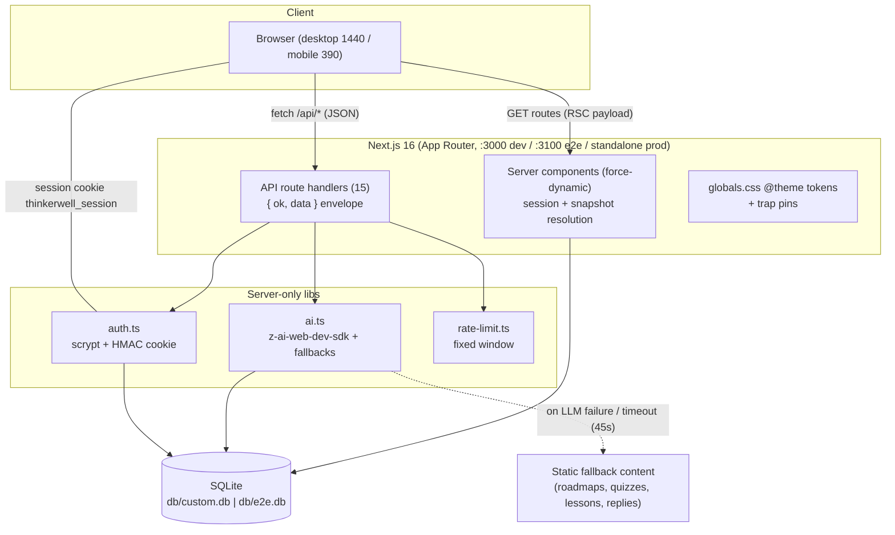
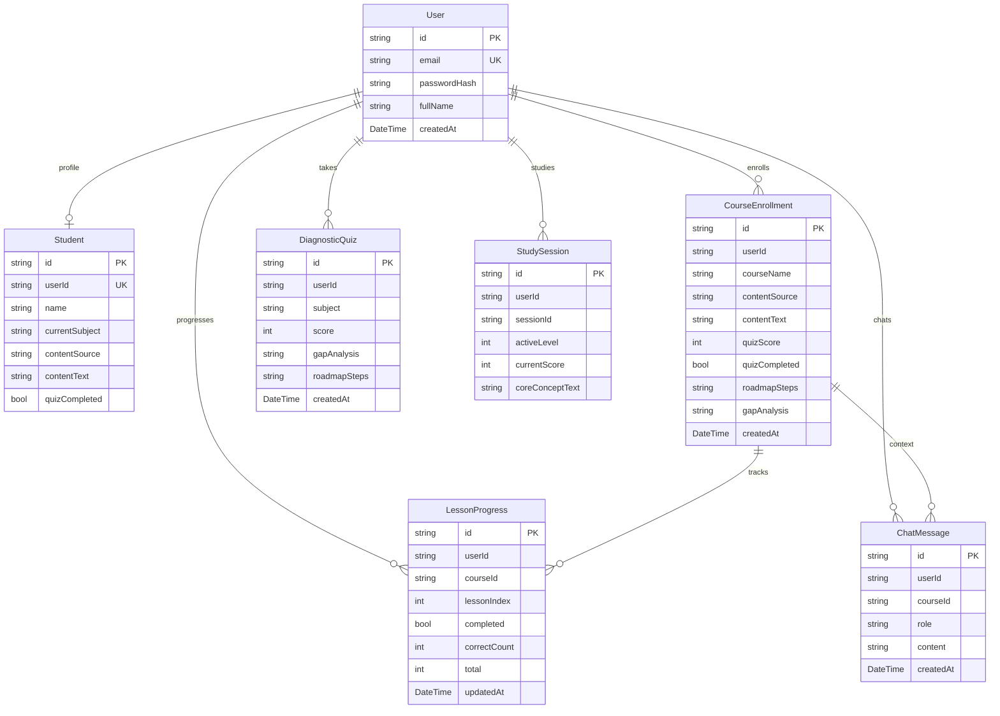

# Thinkerwell (Personalized Tutor App Clone) — Master Project Architecture Document (PAD) v1.17

**Classification:** Internal Engineering Reference
**Status:** DEFINITIVE, PRODUCTION-LOCKED BLUEPRINT
**Companion Document:** [`README.md`](./README.md) (setup/usage) · [`CLAUDE.md`](./CLAUDE.md) (agent conventions) · [`docs/Tailwind-V4-Validation-Report.md`](./docs/Tailwind-V4-Validation-Report.md) (engine trap log)
**Reference App:** https://personalized-tutor-app.base44.app/ (Base44 SaaS, "Thinkerwell")
**Last Updated:** 2026-10-03
**Audience:** Senior Engineers, Tech Leads, DevOps, and Onboarding Engineers
**Rule:** Every architectural decision in this document traces to a specific rationale. Nothing is here "because it's popular."

---

#### Revision Block — v1.17 (Tracked Changes)

- `[SR]` Full clone build: 7 routes, 16 API handlers, 7 Prisma models, AI seam with fallbacks, measured design system, 65 unit + 45 e2e checks at v1.4 → 73 unit + 52 e2e at v1.5 → 82 unit + 64 e2e at v1.7 → 91 unit + 69 e2e at v1.8 → 108 unit + 76 e2e at v1.9 → 125 unit + 82 e2e at v1.10 → 153 unit + 86 e2e at v1.11 → 175 unit + 90 e2e at v1.12 → 179 unit + 91 e2e at v1.13 → 182 unit + 91 e2e at v1.14 → 182 unit + 91 e2e at v1.15 → 186 unit + 91 e2e at v1.16 (the four shard-env pins join; the e2e count invariant holds — the sharded runner executes the same 91, not more) → 197 unit + 91 e2e at v1.17 (the eleven shard-plan pins join — the balanced-shard derivation; the e2e count invariant holds, and the sharded runner now ENFORCES it at runtime: the executed sum must equal the --list total plus N-1 setup copies).
- `[SAN]` Tailwind v4 engine traps pinned in `globals.css` (EIGHT documented differences vs the reference's v3 compiled CSS — see the companion trap log).
- `[AUTH]` Session-cookie `secure` flag derived from request protocol (fixes silent cookie drops on plain-HTTP production boots — the e2e boot caught it).
- `[RES]` Mobile navigation fix: empty toast container made `pointer-events-none` (the live reference ships the bug; Playwright refuses the covered hamburger tap — pinned by `tests/e2e/mobile-navigation.spec.ts`).
- `[S2]` Session-2 parity pass (see `docs/remediation-plan-session-2.md`): the reference's exact 99-line content pool + per-load random bubble picks (server-side prop); the lesson-quiz flow ported to the reference semantics (800 ms auto-advance, retry-later re-queue, 8-to-complete, in-pane "Level Up!" interstitial at stage boundaries with live 1200/800 ms timing); the three confetti presets (`src/lib/confetti.ts` + `canvas-confetti`); Study Streak + Total XP cards (days = min(quizScore,7), XP = pct·10 + score·50); the interactive Daily Challenge modal (upgraded `/api/challenge` returning question/hint/options/correctIndex); conditional Course Progress tint; typewriter topics synced to the reference list; identity sweep (package.json, .env, configs de-ORBITAL'd, `personalized-tutor-app_SKILL.md` replaces the stale scaffold skill).
- `[S3]` Session-3 architecture pass (see `docs/remediation-plan-session-3.md`): the lesson view ported to the reference's decoded gO/yO/xO + Im architecture (subject h2 on level 1 / AI title on 2-3, per-level Core Concept / Real-World Scenario / Final Boss Challenge cards, per-question video + reading content cards, tan 2-column `#E1C8B9` option grid with green/red reveal + CircleCheckBig/CircleX icons, "Next Question" button, 1000 ms reveal → 800 ms advance timing); the hub sidebar's 3-state rows (done/active/locked — the active index drives all three) with the session-scoped "N+1/8" Lesson Progress card (BookOpen icon); per-stage lesson-title suffixes (Basics/In Practice, Fundamentals/Application, Deep Dive/Mastery); the mobile lessons sheet (All Lessons header, black active rows, stage-number-twice labels); subject-icon course cards (keyword-mapped lucide icons, black tiles, Trash2 + ChevronRight, quiz-derived progress); Nori chat question-context prefix (`[Current question: …]` on `/api/chat`); **the quiz-derived progress model** — the reference has no per-lesson entity, so `quizProgressPercent = round(score/5×100)` drives every dashboard/courses number (the demo's 60% = round(3/5·100); the percent clamps at 100, fixing the live's >100% bug); gap_analysis render removed (the live never displays it).
- `[S4]` Session-4 parity pass (see `docs/remediation-plan-session-4.md`): the **Q5 "Add a Course" in-page modal** (`add-course-modal.tsx`, decoded from the live bundle: overlay blur 6px, #C8AEFF card, Build/Material mode cards, the 6 `ADD_COURSE_TAGS` quick tags that set the topic `"Subject: Sub"`, Paste Text/Upload File tabs, Start Assessment → `POST /api/courses/generate` → `/quiz?course={id}`) replacing the `/onboarding` link on `/courses`; the **two-dropdown header split** — the bordered Course pill (p_) labeled `current_subject` listing the OTHER courses (or "This is your only course") + All Courses + Add-a-Course (opens Q5), beside the m_ user menu (course context line `"{subject} · Custom material|Default"`, inline Update Preferences Name form → `PUT /api/student`, My Courses, Log Out); the hub header's span switched to the CURRENT LESSON TITLE and its pill rows now route to `/?course={id}` (the dashboard) with the "current" badge and "No courses yet" placeholder removed; the `/demo` surface runs the real guest-mode AppHeader (Economics Course pill + Guest m_ menu; writes degrade to sign-up routes). 49 → 55 unit, 36 → 41 e2e.
- `[S5]` Session-5 chrome-polish pass (see `docs/remediation-plan-session-5.md`): the **mobile hamburger menu reworked to its own reference component** (items `p-2` without space-y; a Switch Course section when enrollments > 1 — label `text-[10px] font-light`, BookOpen rows, a Check on the CURRENT course, rows route to `/?course={id}`, `h-px bg-black/10 my-1` divider; My Courses; Log Out — or guest-mode **Sign In**; NO Update Preferences on mobile; the header context line renders the subject alone in `text-xs text-black/60`); the **m_ name split** — the desktop panel header renders the STUDENT's name (the `PUT /api/student` target, so renames round-trip) while the collapsed pill keeps the USER's name, with the with-course panel header re-metriced to `p-4`/`gap-3`/`w-10` avatar at `text-base` (no-course stays `p-3`/`gap-2.5`/`w-8` with plain `p-2` items); the **`rounded-[9999px]` sweep** (49 usages — v4's `rounded-full` computes to `calc(Infinity*1px)` = 33554400px vs the reference v3's 9999px); typewriter retimed to the bundle's `o_` machine (60 ms type / 50 ms delete / 2000 ms hold, full first topic on load); the 21px category chips (py-1, text-[13px], leading-none, bg 0.5); `isCustomSource` extracted to `domain.ts`; `saveName` now honors the `{ok,error}` envelope + failure toast; the duplicated outside-click effect extracted to `useDismissOnOutsideClick`; the hub's dead `courses[].current` field dropped; p_ panel icons at strokeWidth 2; the guest pill hover `bg-black/5`. 55 → 65 unit, 41 → 45 e2e.
- `[S6]` Session-6 parity-polish pass (see `docs/remediation-plan-session-6.md`): the **mobile menu runtime-verified end-to-end** (hamburger tap, Switch Course rows with the Check on the current course navigating `/?course=`, guest Sign In — the live still ships the covering toaster bug); three **icon-level drifts decoded and closed** — the /courses Add tile's Plus (the clone shipped a typo'd `M12 5v19` path; now the lucide-canonical `v14` at sw 2), the CO card ChevronRight (sw 2 = lucide default, not 1.5), and the m_ pill chevron's CONDITIONAL weight (`student ? 2 : 1.5` — the live ships two trigger components); the **source-predicate split named and pinned** (`courseSourceLabel` custom-only for the CO label vs `isCustomSource` custom‖material for the p_ icon — the reference ships exactly this split); the **outside-click hook extraction completed** (`src/components/layout/use-dismiss.ts` — the hub's hand-rolled effect replaced; every dropdown consumes the one hook with useCallback-memoized callbacks); the typewriter timings named as module constants (TYPEWRITER_*_MS, the lesson-view precedent); the Switch Course e2e gains the Check-on-current pin + the single-enrollment negative pin. 65 → 69 unit, 45 → 46 e2e. Also: the live /demo roadmap + challenge question are confirmed AI-generated PER VISIT (titles alternate) — the clone's static sample is a documented accepted divergence, not drift.
- `[S7]` Session-7 computed-style parity pass (see `docs/remediation-plan-session-7.md`): the audit methodology upgraded to **computed-style histogram diffing** (leaf-text font-weight distributions + class→radius maps, live vs clone — computed styles are the ground truth, class strings the approximation); it surfaced and closed **the app-wide base font-weight** (the live's body computes 300 — font-light is the default inherited by every weight-less text node: mode-card descriptions, category tags, "N/6 lessons completed"; the clone shipped 400); **TWO new Tailwind v4 engine traps** — the radius-scale shift (the reference's custom v3 config maps rounded-lg AND rounded-xl to 12px vs v4's 8/14px — `--radius-lg`/`--radius-xl: 0.75rem` pins, Trap 6, 41 usages) and the blur-scale shift (the login card's backdrop-blur-sm computes 4px on v3 vs 8px on v4 — `--blur-sm: 4px`, Trap 7, the shadow pin's sibling); and **the Course-Lessons icon column** (lucide CircleCheckBig done / Circle next / Circle later-at-/40 status icons at w-4 h-4 sw 1.5 decoded from the live — replacing the session-1 scaffold's numbered circles; states keyed off the new `lessonRowStatus` domain helper, unit-pinned). 69 → 73 unit, 46 → 52 e2e.
- `[S8]` Session-8 public-surface parity pass (see `docs/remediation-plan-session-8.md`): the live's ANONYMOUS surfaces probed for the first time — **the public-surface model corrected**: anonymous `/` and `/onboarding` render the PUBLIC ONBOARDING (AppHeader `signedOut` variant: desktop black Sign In pill, mobile items-only menu — My Courses + Sign In, no yellow name header; the anonymous "Your Name" block in the setup panel, required for Continue; the `pending_student_setup` sessionStorage deferral → `/login?from_url=<current>` → the post-login pickup AUTO-SUBMITS through `/api/courses/generate` → `/quiz` — the live's X2 contract with the account name winning `full_name || pending.name`); **`/demo` auth-gated** (the live registers it under the auth guard — anonymous → `/login?from_url=%2Fdemo`); **the Try-it invariant decoded** ("Try it Sample: Economics Course" NAVIGATES to `/demo` — `onTryIt: () => navigate("/demo")` in the bundle; the is_sample pending path is dead code, no writer); **the hub LessonView h2 subject** = the STUDENT's `current_subject || "General"` via the unit-pinned `hubLessonSubject` helper (never the active course name; an unowned `?course=` renders the default-grid hub); **the challenge modal decoded** (overlay inline `rgba(0,0,0,0.5)` — Trap 8 — NO backdrop blur, NO result banner; the Submit button swaps in place to "Close" after the reveal); **the dashboard card icons** (Trophy/Brain/BookOpen/Sparkles at h-6 w-6, Course-Lessons BookOpen at h-4 w-4, modal-header Brain at h-5 w-5 — probed from the live's path `d` data, replacing the session-2 TrendingUp/Sparkles drifts); **Trap 8 documented** (v4's alpha colors compute `oklab(0 0 0 / .5)` vs v3's `rgba(0,0,0,.5)` — the streak weekday letters + the challenge overlay normalize via inline rgba; zero chromatic alpha usages, so the drift is serialization-only). 73 → 82 unit, 52 → 64 e2e.
- `[S9]` Session-9 level-surface parity pass (see `docs/remediation-plan-session-9.md`): the live's quiz flow driven through a FULL lesson completion for the first time (the terminal state prior sessions never reached) — **the Lesson Progress label decoded as UNCLAMPED** (the live's qP renders `{answered + 1}/8` with no clamp: "9/8" observed at the 8th correct through the Level-Up interstitial; the clone's Math.min clamp removed via the unit-pinned `lessonProgressLabel`/`lessonProgressPct` domain helpers); **the desktop anonymous Sign In pill's from_url decoded** (the live's Ha pill calls `navigateToLogin()` = `ge.auth.redirectToLogin(window.location.href)` — the current URL rides on both the desktop pill and the mobile item; the clone's pill previously pushed a bare /login); **the hub level machinery re-decoded** (the live's sidebar activeLessonIndex is NEVER written after mount — the setter only runs in the course-change reset, locked rows are unclickable, and the qP's activeLevel/levelingUp props are dead — the live's hub DEAD-ENDS after lesson 1's completion; the clone's advancing 6-lesson flow is the documented doctrine fix); **the level-2/3 lesson surfaces e2e-pinned for the first time** (the tan Real-World Scenario + lilac Final Boss context cards render conditionally on the generated scenario/challenge; the h2 = the GENERATED title on levels 2/3 per the yO/xO decode — pinned via the hub's `?lesson=2|4` params, which drive the initial lesson directly); **a lucide version trap found** (BookOpen AND Trophy were REDESIGNED upstream between the live's lucide-react 0.475 and the clone's 0.525 — the dashboard card icons pin the live's exact path data as parameterized local components; swapping them for current lucide imports would change the rendered strokes and break the session-8 icon pins); `/demo` gained the documented `force-dynamic` export; the icon constants deduplicated (the dead LESSON_ICON deleted); the onboarding validity thresholds unified into one predicate. 82 → 91 unit, 64 → 69 e2e.
- `[S10]` Session-10 chat-surface parity pass (see `docs/remediation-plan-session-10.md`): the live's Nori chat driven through a real exchange for the first time (the session-9 handoff's suggested target) — **the chat USER bubble decoded as BLACK `#0F0E0E` + white text** (radius 16/16/4, the same classes as the assistant bubble mirrored; the clone's yellow bubble was a session-1 invention never live-diffed), **the send button decoded as lucide's Send paper plane** at w-3.5 h-3.5 sw 1.5 (paths verified IDENTICAL across the live's lucide 0.475 and the clone's 0.525 — the one safe lucide swap; the clone's arrow-up was drift), **the client-side from_url contract re-decoded with a query-carrying URL** (the live's navigateToLogin = redirectToLogin(window.location.href) — path AND query ride; verified: the anonymous pill at `/?q=parity` routes to `login?from_url=%2F%3Fq%3Dparity`; the clone's three writers now go through the unit-pinned `loginRedirectUrl(pathname, search)` helper, and the login page consumes from_url via `sameOriginRedirectTarget` — same-origin absolutes decode to path+search, foreign origins and `//` collapse to `/`, FIXING the open-redirect vulnerability the live ships; both the query-carrying round-trip AND the foreign-origin rejection are e2e-pinned), **the hub back-links + "?" menu decoded** (the desktop logo AND the mobile Dashboard link href `/?course={id}` — a bare `/` would land on the FIRST enrollment; the ? menu is the m_ panel with NO user: the "?" avatar + EMPTY name/email lines + a LayoutGrid My Courses icon — the clone's user-identity header was an invention); **the mobile-nav headline re-verified** (the live's toaster-cover mechanism precisely measured: two fixed w-full 32px containers with pointer-events auto — `elementFromPoint` at the hamburger's center IS the toaster; the live's menu cannot be tapped open; the clone's fix + pins hold); the session-9 R5 threshold consolidation completed (`onboardingInputsValid` in domain.ts, both call sites); the live's demo-course chat confirmed EPHEMERAL across reloads (the clone's persistence stays the documented divergence). 91 → 108 unit, 69 → 76 e2e.
- `[S11]` Session-11 quiz-surface parity pass (see `docs/remediation-plan-session-11.md`): the diagnostic-quiz component (E3) decoded wholesale from the live bundle (the entity-write 403s block a live drive — the onboarding Continue fires `POST /entities/Student` → 403, dead-ending at `/`; `/demo`'s retake is a no-op — so the bundle is the ground truth, per the "read the compiled reference" doctrine) — **the session-1 quiz surface was almost entirely invention**: the live asks **exactly 5 questions** ("2 easy, 2 medium, 1 harder", ≤ 20 words, with a custom-material context preamble), the header is the Ha-with-children variant ("{subject} · Knowledge Assessment" + the X close button REPLACING the desktop user menu), the progress row carries a **42px star SVG** riding a `#FFFD73` fill on a `#4A4A4A` track, the question row is a lilac `#D2C0F9` number tile, the options are **TAN `#E1C8B9` with inline `A.`-prefixes** (picked = `#0F0E0E` border; reveal: correct `#BCFCAF` + CircleCheckBig, wrong-pick `#FFD0D0` + CircleX, others 40%), the actions are "Confirm" → "Next Question" / "Submit Assessment", a dot strip + the fixed "Skip quiz →" pill complete the card, and the load/submit overlays are the dark W surfaces ("Preparing your assessment…" / "Analyzing your results…"). **The score semantics were a real bug**: the live computes the CORRECT count client-side (`diagnosticScore`, unit-pinned) while the clone's server derivation scored every ANSWERED question correct — every completed quiz scored 100%; the submit route now stores the validated payload score. The /-route model aligned to the live's $P (the course dashboard renders whenever an enrollment exists — the skip/close paths land on the 0% dashboard; the new `POST /api/quiz/skip` implements the live's wO onSkip, minus the LLM call the live discards). The AI prompts aligned (the named/pct-aware gap analysis, the material context, the pct-based submit-time roadmap), the DiagnosticQuiz write became an upsert, and the login page's origin construction moved into the pinned `headerOrigin` helper. 108 → 125 unit, 76 → 82 e2e.
- `[S12]` Session-12 dashboard-decode parity pass (see `docs/remediation-plan-session-12.md`): the dashboard's c_ column (the Course-Lessons card) decoded whole from the (unchanged) live bundle — the quiz-milestone confetti was a session-2 MISPLACEMENT (E3 fires zero confetti during the diagnostic quiz; the decoded triggers — the 80-particle streak burst at min(quizScore,7) crossing EXACTLY 3 or 7 + the 90-particle mastery-label burst at the Novice→Master tier change, the label never rendering — live on the DASHBOARD), the session-11 material gate was DEAD CODE (`contentSource === "custom"` is unreachable — every writer emits topic|material; the S11-F4 prompts now fire via `enrollmentMaterial`, the broad custom-source predicate), and the roadmap prompts split back to the live's THREE shapes (the generate-time "stages" prompt restored vs the submit-time pct-aware "focus areas" — with the `{"steps":[…]}` wrapper response parsing the array-only parser silently discarded). Plus: the Enter The Hub trailing icon decoded as ChevronRight at lucide default sw 2 (the ArrowRight was a session-1 invention), the submit route 422s on present-but-invalid score/answers, skip() consumes the envelope redirectTo, and the quiz star rides the QuizStar next/image-unoptimized wrapper. 125 → 153 unit, 82 → 86 e2e.
- `[S13]` Session-13 course-switch + data-contract pass (see `docs/remediation-plan-session-13.md`): the same-route course switch was **functionally broken** — the dashboard shell's `viewCourseId` state was frozen at mount (its setter had no caller), so the CoursePill rows' `router.push("/?course=")` re-rendered the shell with fresh props while `activeCourse` kept resolving the mount-time course (empirically: the pre-switch course's streak/XP persisted until a full reload; the session-12 "the App Router remounts the page" diagnosis was FALSE — nothing remounts, the stale state ignored the fresh props). `activeCourse` now derives from the `currentCourseId` PROP — the switch works AND the ported c_ confetti triggers fire on their natural surface (a course switch crossing a streak boundary or mastery tier, e2e-pinned with dedicated content/burst/label drives — the 90-particle label burst's first behavioral pin). The same pass: the `{steps}` wrapper parser ARRAY-CHECKS `parsed?.steps` (a lazy string reply crashed `.every` → 500 — the "AI may degrade, never fail" invariant, empirically reproduced), the roadmap response schemas split to the live's verbatim decode (generate-time OBJECTS vs submit-time STRING arrays — its response_json_schema — with `parseRoadmap` mapping both via the live's Kh/roadmap-card split semantics: strip the `Step N:` prefix, split `" — "` else `": "` under 40 chars), the submit route's 422 symmetry completed (non-array answers, non-integer total), the e2e AI-timeout convention applied to the request-level calls (60s) with the confetti assertion converted from a fixed wait to a poll, and the false session-12 mechanism claims corrected across all five docs + the spec comment. 153 → 175 unit (the first `tests/ai-seam.test.ts` — the vitest `server-only` stub alias), 86 → 90 e2e.
- `[S14]` Session-14 pin-the-pin pass (see `docs/remediation-plan-session-14.md`): the two-axis review of the session-13 commit found the one real gap — **the R1 prompt-tail unit pin was VACUOUS** (`expect(true).toBe(true)` with a comment claiming the mock's call history "is not directly exposed" — it is: the mocked `completions.create(req)` receives `req.messages`). The mock now captures the transport request, and both roadmap prompt tails are asserted VERBATIM (the generate-time object tail with "2-3 sentence description." + the submit-time string-array tail, plus the material-aware subject swap and bidirectional negatives — mutation-verified: swapping the tails fails exactly the two new pins). The same pass: the streak-burst e2e drive gained its first CONFOUND-FREE isolation pin (scores 6/7 with total 7 — `quizProgressPercent` clamps 120/140 → 100 → tier Master→Master so the label burst cannot fire while streak 6→7 crosses EXACTLY 7; e2e-pinned + pixel-verified at 1,383 burst-particle pixels vs a direct-mount baseline), the submit route consolidated to validate-first/derive-after (ALL present-but-invalid 422s run before the enrollment lookup; the derivations read only validated input — the dead `&& body.total > 0` guard and the score re-derivation cascade removed; the 422 status matrix byte-identical), the dual-shape OBJECT arm became ONE shared `isStageObject` guard in domain.ts (consumed by parseRoadmap AND the AI seam's element validator, with direct unit pins), `STAGES_PER_COURSE` replaced ai.ts's magic 3, the "THREE prompts" comment now names the discarded skip-time variant, the unused eslint-disable was removed (lint back to zero findings), and the superseded session-11 one-shot dev-server probes were retired (their coverage lives in the e2e spec — git history is the archive). 175 → 179 unit, 90 → 91 e2e; screenshots 91-96 (the remediated dashboard, the isolated streak burst, the course-switch flow, the hub mobile tab shell + Ask Nori + Lessons tabs at 390×844 — the session-13 handoff's suggested surface).
- `[S15]` Session-15 conventions pass (see `docs/remediation-plan-session-15.md`): the audit followed the session-14 handoff's test-quality/hygiene direction and found ZERO parity gaps (the live bundle byte-identical for the 6th consecutive session — md5 f99e7279…; the mobile-nav headline re-verified — the live's hamburger tap still REFUSES at 390×844 while the clone's 12/12 real-tap pins hold on the fresh build; scandihaven unchanged). The real findings were three conventions that existed but were enforced NOWHERE: (1) **the trap-39 60s-timeout convention had never been backfilled to the four specs session-13 didn't touch** — 8 AI-backed request-level calls (mobile-navigation ×2, session11 ×3, session5 ×2, session8 ×1) riding Playwright's 30s request default against the 45s AI budget, a latent flake that only fires when the LLM is reachable-but-slow (the sandbox's fast-fail fallbacks masked it); (2) **the e2e course fixtures were triplicated** (generateCourse/freshCourse + the GENERATED/afterEach cleanup, ~120 duplicated lines across session11/12/13 — the drift that caused finding 1); (3) **the lint gate suppressed rules the codebase already passes** (experiment-verified: react-hooks/purity, prefer-const, no-unreachable, no-redeclare at ZERO findings). The remediation (TDD): the 8 timeouts backfilled and the convention made SELF-ENFORCING — `tests/e2e-conventions.test.ts` scans every spec source + helpers.ts with a string/comment-aware balanced-paren scanner and fails the UNIT gate when any AI-backed request call lacks `timeout: 60_000` (a scanner-self-test guards the empty-match case — trap 40's lesson applied to the tooling itself); the fixtures extracted to ONE canonical `tests/e2e/helpers.ts` (generateCourse/submitScore/cleanupGeneratedEnrollments/restoreDemoStudent — the e2e count stays EXACTLY 91, the refactor is count-invariant, all four migrated specs re-run green); and the lint gate hardened (purity back at next-default ERROR, prefer-const/no-unreachable/no-redeclare/no-useless-escape/no-console at warn, no-console scoped off for scripts/** + prisma/**; the single no-useless-escape finding fixed — domain.ts's `[:.\-\s]` character class un-escaped, guarded by the parseRoadmap unit pins; exhaustive-deps stays OFF by documented trade-off — the 3 intentional suppressions in the pinned quiz-flow timing effects). The session also diagnosed and documented the **orphaned-webServer trap** (a tool-timeout kill leaves the :3100 standalone server alive; a later `next build` swaps `.next/static` under it → ChunkLoadError → hydration fails → every AI-effect test hangs — kill it via `ss -tlnp | grep 3100` before a fresh run; the gate note in AGENTS.md carries it). 179 → 182 unit, 91 e2e unchanged; screenshots 97-99 (the remediated dashboard, the clone's mobile menu OPEN — the tappable contrast to the live's 6th-verified refusal — and the hub mobile Learn tab at 390×844).
- `[S16]` Session-16 dead-code/deps pass (see `docs/remediation-plan-session-16.md`): the audit followed the session-15 handoff's three suggested directions and closed all three, with ZERO parity gaps behind them (the live bundle byte-identical for the 7th consecutive session — md5 f99e7279…, 788 085 bytes, `/assets/index-CkEI9gsZ.js`; the mobile-nav headline re-verified for the 7th — the live's hamburger tap still REFUSES, `elementFromPoint` at the button center IS the `fixed top-0 z-[100]` toaster with `pointer-events: auto`; the clone's fix + 12/12 real-tap pins hold; scandihaven unchanged). (1) **`react-hooks/exhaustive-deps` is now ON** — the session-15 "documented trade-off" (3 intentional suppressions in the pinned quiz-flow timing effects) retired via the LATEST-REF pattern: a `useRef` + a no-deps update effect declared BEFORE the consumer decouples the callback identity from the consuming effect's deps, so the pinned firing triggers stay EXACTLY (`[lessonIndex]` for the session-counter reset, the question identity `[q]` for the chat-context reporter — a superset-equal of the old text-only trigger, immune to its duplicate-text blind spot — and `[publicMode]` for the post-login pickup), with no useCallback refactor and the e2e-pinned auto-advance/pickup semantics as the proof harness; (2) **the 18 `src/` unused-vars findings cleaned to ZERO** — the 6 genuine dead-code sites removed (the vestigial `courseName` prop since the S8-F4 subject-h2 fix, the public-surface-model-vestigial `user`/`studentName` props, the never-rendered `deleting` state, the uncalled `toast` destructure, and `fallbackLesson`'s vestigial `lessonNumber` — the whole chain from the route through `generateLessonContent` trimmed) plus 5 script-level cleanups; `@typescript-eslint/no-unused-vars` enabled TS-aware (`^_` ignore patterns, caughtErrors none) so named type-contract params keep their documentation names while future dead code fails the gate; (3) **the unit runner runs `isolate: false`** — a 5× wall-clock win (1.9s → ~0.4s across the 15 files), validated before adoption with 5 full runs incl. 2 shuffle-seed orderings (the ai-seam transport-capture pins would fail on any cross-file vi.mock leakage — the mock-pollution hazard probed directly). 182 unit + 91 e2e unchanged (the count-invariant hygiene pass — behavior-preserving refactors proven by the existing pins); screenshots 100-102 (the remediated dashboard, the clone's mobile menu OPEN at 390×844, the courses page).
- `[S17]` Session-17 lint/sharding/manifest pass (see `docs/remediation-plan-session-17.md`): the audit followed the session-16 handoff's three directions and closed all three, with ZERO parity gaps behind them (the live bundle byte-identical for the 8th consecutive session — md5 `f99e7279…`, 788 085 bytes; the mobile-nav headline re-verified for the 8th — the live's hamburger tap still REFUSES, `elementFromPoint` at the button center IS the `fixed top-0 z-[100]` toaster; the clone's fix + 12/12 real-tap pins hold; scandihaven unchanged at `cb0002a` — its e2e is serial too, so the sharding design is original). (1) **the scaffold lint block retired to its final two DOCUMENTED offs** — `no-debugger`/`no-irregular-whitespace`/`no-case-declarations`/`no-fallthrough`/`no-mixed-spaces-and-tabs`/`no-empty` enabled (experiment-verified; the ONE no-empty finding — an empty `catch {}` in the probe script's retry loop — fixed with a self-documenting comment, no option relaxation); `no-undef` stays off DOCUMENTED (not type-aware: false-positives the JSX scope's `React` + the `@types/node` ambient `NodeJS` — the `typecheck` gate owns the hazard); and the dead duplicate `"@typescript-eslint/no-unused-vars": "off"` entry removed (JS duplicate-key semantics: the session-16 enablement block wins; the dead line misread as "off" — trap 43); (2) **the sharded e2e harness** — `bun run test:e2e:sharded` runs the SAME 91 checks as N parallel playwright shards (`--shard=k/N`, default 3), each with its OWN port (3111+), OWN `db/e2e-shard-{k}.db`, OWN `.auth/user-shard-{k}.json`, and OWN `test-results/shard-{k}/` outputDir — the isolation design validated EMPIRICALLY before implementation (Playwright duplicates the setup dependency project into every shard per `--shard --list`; the specs are per-test isolated — no beforeAll/serial; `.gitignore` already covers the artifacts), and the two REAL failure modes found and fixed during bring-up: the shared `test-results/` cross-process disposal race (per-shard outputDir — trap 44) and the child spawn via `bun cli.js` parsing the TS config as plain JS (spawn via `bunx playwright` — trap 45); the derivation is ONE pure unit-pinned module (`tests/e2e/shard-env.ts`), the wrapper (`scripts/e2e-sharded.mjs`) only orchestrates (orphan pre-flight per trap 41, spawn, aggregate, cleanup), and the serial `test:e2e` stays the byte-compatible DEFAULT; (3) **the manifest lower bounds mirror the gate-verified lockfile** (next `^16.3.8`, react `^19.3.0`, prisma `^6.19.3`, typescript `^5.9.3`, … — a zero-resolution-change edit: the lockfile pins already satisfy them; the majors Prisma 7 / lucide-react 1.x / eslint 10 / TS 7 stay out of scope by doctrine, lucide 1.x would re-drift every decoded icon path). 182 → 186 unit (the four shard-env pins), 91 e2e unchanged (the count invariant holds in BOTH modes — the sharded runner executes the same 91; `playwright --list` verifies); screenshots 103-105 (the remediated dashboard, the clone's mobile menu OPEN at 390×844 — the 8th-verified contrast — the hub desktop three-pane).
- `[S19]` Session-19 balance + strictness pass (see `docs/remediation-plan-session-19.md`): the audit followed the session-17 handoff's three directions with ZERO parity gaps (the live bundle byte-identical for the 9th consecutive session; the mobile-nav headline re-verified for the 9th — the live's tap still refuses behind the toaster cover while the clone's 12/12 real-tap pins hold; scandihaven unchanged at `cb0002a`; `.env` == `.env.example` re-verified). (1) **The sharded e2e harness now plans shards by AI weight** — the count-based `--shard=k/N` split put 17 of the 22 direct AI-route request-level calls on ONE shard (session11:3 + session12:8 + session13:5 + session10-parity:1), which in the reachable-but-slow LLM regime (each AI call budgeting the 45s `AI_TIMEOUT_MS`) degenerated the parallel harness to the serial wall clock (the heavy shard alone ≈ 17×45s ≈ 13 min while the others idled after ~2 min). The remediation is LPT (largest-processing-time-first) bin-packing over `weight = aiMentions × 45 + testCount` in ONE pure unit-pinned module (`tests/e2e/shard-plan.ts` — 186 → 197 unit, the eleven pins); the wrapper spawns per-shard FILE LISTS (`bunx playwright test tests/e2e/auth.setup.ts <group…>`) with `auth.setup.ts` prepended to EVERY shard (reproducing the setup-duplication semantics `--shard` itself provided — each shard signs the demo user in against its own server), derives the inventory from playwright's OWN `--list` (zero drift vs a filesystem walk; NOTE the setup list-line ends `.setup.ts`, not `.spec.ts` — a regex that misses it runs the expected count one short), and ENFORCES the count invariant at runtime (the parsed per-shard "N passed" lines must sum to `total + N − 1` on green runs — the failure the first bring-up run hit exactly, fixed by the regex); the plan lands 364/313/313 on the current inventory vs the count-based 56/765/220 — a ~2.1× slow-regime critical-path improvement, serial mode byte-identical, the static aiMentions undercount of UI-driven AI flows documented and ballast-robust; (2) **`noImplicitAny: true`** — the last scaffold TypeScript concession (the old K-4) retired for FREE: the flip produced ZERO typecheck errors on the current tree (canary-verified the flag bites — a synthetic implicit-any parameter fails with TS7006), so `strict: true` now means what it says and any new untyped parameter fails the typecheck gate; (3) **the AI-seam e2e speedup DEFERRED by documented rationale** (recorded fixtures would change what the suite verifies — the real seam + the 429-fallback paths ARE the contract; the balanced sharding captures most of the wall-clock win without touching semantics). 197 unit + 91 e2e, both e2e modes green; screenshots 106-108 (the remediated dashboard, the clone's mobile menu OPEN at 390×844 — the 9th-verified contrast — the hub desktop three-pane).

---

## Table of Contents

1. [System Overview & Decisions](#1-system-overview--decisions)
2. [High-Level System Topology](#2-high-level-system-topology)
3. [Application Architecture](#3-application-architecture)
4. [Data Architecture](#4-data-architecture)
5. [The AI Seam](#5-the-ai-seam)
6. [Design System Architecture](#6-design-system-architecture)
7. [Security Architecture](#7-security-architecture)
8. [Testing Strategy](#8-testing-strategy)
9. [Build, Run & Deploy](#9-build-run--deploy)
10. [Developer Handbook](#10-developer-handbook)
11. [Known Issues & Deferred Work](#11-known-issues--deferred-work)

---

## 1. System Overview & Decisions

### 1.1 Document Metadata & Purpose

This PAD is the single source of truth for the Thinkerwell clone. Use it to
understand why the stack is what it is, how a request flows from the yellow
header to SQLite and back, where the AI boundary sits, and which invariants
(gate order, envelope shape, fallback guarantee, mobile-nav fix) must survive
every future change. New engineers should read §1-§4 then §10; reviewers
should read §1.3 (ADRs) and §7; anyone touching CSS must read §6 and the
companion trap log first.

### 1.2 Technology Stack Summary

| Layer | Technology | Version | Key Rationale |
|-------|-----------|---------|---------------|
| Web framework | Next.js (App Router, standalone output) | 16.1 | The reference is a multi-route SPA; App Router routes map 1:1 to reference URLs. Standalone output gives a single-file deploy artifact. |
| UI runtime | React | 19 | Required by Next 16; server components resolve session state without client waterfalls. |
| Language | TypeScript (strict, `noImplicitAny: false`) | 5 | Type safety at the API envelope and DTO seams; the explicit `typecheck` gate compensates for `ignoreBuildErrors` in next.config. |
| Styling | Tailwind CSS (CSS-first `@theme`, no config file) | 4 | The scaffold's engine; token parity with the reference's v3 compiled CSS achieved by pinning (see §6 and the trap log). |
| Database | SQLite | 3 (bundled) | Zero-config self-hosting; the reference's entities map to a small relational schema. |
| ORM | Prisma | 6 | Typed schema, `db push` workflow, schema-relative `file:` URL resolution (tested seam). |
| Auth | Hand-rolled scrypt + HMAC cookie | — | No external auth service; full control of the cookie's `secure` derivation (§7). |
| AI | z-ai-web-dev-sdk (server-only) | 0.0.18 | LLM for roadmap/quiz/lesson/chat generation; every flow degrades to static fallbacks (§5). |
| Unit tests | Vitest | 5 | Fast node-environment tests for the pure domain seams. |
| E2E tests | Playwright | 1.63 | Drives the real standalone build; the only way to pin the mobile-nav interaction. |
| Package runtime | Bun (npm-compatible) | ≥1.1 | The scaffold's script runner; `npm install` works identically. |

### 1.3 Architecture Decision Records (ADRs)

**ADR-001: Real App Router routes, not an SPA rewrite shell**

- **Context:** The reference is a Vite SPA with client-side routing; the
  sibling ORBITAL clone chose one page + rewrites. This app's reference has
  seven distinct, bookmarkable URLs (`/`, `/onboarding`, `/courses`, `/quiz`,
  `/hub`, `/demo`, `/login`) with distinct document titles.
- **Decision:** One App Router folder per route. Server components resolve
  the session and a serializable snapshot; a single client shell per route
  owns interactivity.
- **Rationale:** Next.js handles the URL ↔ view mapping natively; no custom
  router seam to drift; per-route `force-dynamic` keeps auth redirects
  server-side; page titles match the reference exactly.
- **Consequences:** ✅ Bookmarkable parity, simpler mental model, natural
  code-splitting. ❌ Route transitions are full navigations (fine for this
  app's scale); duplicated desktop/mobile DOM in the Hub (documented locator
  rule in §8).
- **Alternatives rejected:** Single page + `rewrites()` (ORBITAL pattern) —
  rejected: the router seam is a maintenance liability when the reference
  has real routes; Next's rewrite table drifts from the client store.

**ADR-002: SQLite + Prisma with a tested path-resolution seam**

- **Context:** Self-hosters must clone-and-run with zero services; the
  Prisma CLI resolves relative `file:` URLs against `schema.prisma`, but the
  Next standalone server rewrites module paths — a naive relative URL
  resolves differently per runtime.
- **Decision:** SQLite via Prisma; `src/lib/db-path.ts` anchors resolution
  (standalone detector → module repo root → CWD), pinned by
  `tests/db-path.test.ts`; `db.ts` imports the seam and exports one client.
- **Rationale:** One database file for dev, build, standalone, and e2e (which
  swaps `DATABASE_URL` for its own `db/e2e.db`). PostgreSQL remains a
  `provider` swap away for hosted deploys.
- **Consequences:** ✅ Zero-config; deterministic path behavior under every
  runtime. ❌ Single-writer SQLite (fine at tutoring-app scale); e2e and dev
  need separate seed runs.
- **Alternatives rejected:** PostgreSQL by default — rejected for
  clone-and-run friction; an env-var absolute path — rejected as
  copy-paste-hostile.

**ADR-003: Hand-rolled cookie auth with protocol-derived `secure`**

- **Context:** The clone must boot in dev (HTTP), in e2e (production build
  on plain HTTP :3100), and in real HTTPS deploys. NextAuth was never in the
  scaffold; the ORBITAL doctrine (scrypt + HMAC stateless cookie) is
  battle-tested.
- **Decision:** `src/lib/auth.ts`: scrypt password hashes (16-byte salt),
  HMAC-SHA256-signed `{uid, iat}` cookie (`thinkerwell_session`, 7-day TTL),
  `createSession(userId, req?)` deriving `secure` from `req.url` then
  `x-forwarded-proto` — defaulting to NOT secure unless HTTPS is provable.
- **Rationale:** An env-based `secure: NODE_ENV === "production"` silently
  drops cookies on plain-HTTP production boots — the exact bug that failed
  every authenticated e2e test until traced (a 2-cycle debug cost, now an
  invariant).
- **Consequences:** ✅ Works under every transport; no auth dependency;
  timing-safe comparisons. ❌ In-process rate limiting only (single-node
  deploy); no OAuth (Google button degrades with an explanatory notice —
  documented deviation).
- **Alternatives rejected:** NextAuth — rejected: no platform lock-in, and
  the cookie-transport control matters more than features; JWTs — rejected:
  revocation story worse than a signed stateless payload at this scale.

**ADR-004: The AI seam — real LLM, deterministic fallbacks, one validation gate**

- **Context:** The reference's core flows (roadmap, diagnostic quiz, lesson
  content, Nori chat) are LLM-generated; a self-hosted clone may run without
  LLM credentials, and LLMs return malformed JSON.
- **Decision:** `src/lib/ai.ts` wraps `z-ai-web-dev-sdk` behind seven typed
  generators; each validates the parsed shape (extract-JSON helper, option
  counts, index bounds) and falls back to deterministic static content;
  `aiGenerated` flags ride the API responses.
- **Rationale:** The product must never hard-fail on an AI outage; the UI
  surfaces degradation via toast ("the AI tutor is offline — using the
  built-in roadmap"). One validation gate for LLM and fallback output keeps
  the client dumb.
- **Consequences:** ✅ Flows always terminate; e2e can assert shapes without
  mocking the LLM; fallback quizzes are pedagogically sane. ❌ Fallback
  content is generic (acceptable — the z-ai SDK is present in the target
  environment); 45s AI timeouts add latency ceilings (documented in test
  timeouts).
- **Alternatives rejected:** Require credentials — rejected: breaks the
  zero-config promise; client-side LLM calls — rejected: key exposure.

**ADR-005: Tailwind v4 with pinned v3 parity tokens**

- **Context:** The reference's compiled CSS is Tailwind v3; the scaffold
  runs v4, whose engine differs in five measured ways (palette drift via
  oklch, shadow-scale shift, gradient interpolation in oklab, `space-y`
  selector rewrite, bare-HSL transparent resolution under `@theme inline`).
- **Decision:** CSS-first `@theme` in `globals.css` with full-hex brand
  tokens, the v3 slate hexes pinned, `--shadow-sm` pinned to v3 geometry,
  gradients shipped as arbitrary sRGB values, and the toaster
  pointer-events fix.
- **Rationale:** Byte-identical class attributes must compute identically
  across engines; the trap log (companion doc) documents each measured
  difference and the pin that neutralizes it.
- **Consequences:** ✅ Visual parity without an engine downgrade; the pins
  are grep-able invariants. ❌ Future v4 updates may shift more tokens — the
  trap log is the regression checklist.
- **Alternatives rejected:** Tailwind v3 — rejected: the scaffold and
  sandbox toolchain standardize on v4; `@theme inline` for brand colors —
  rejected: bare-triplet hazard documented in the trap log.

**ADR-006: Playwright e2e against the production standalone build**

- **Context:** Dev-mode React StrictMode double-rendering and dev overlays
  poison computed-style assertions; the mobile-nav pin requires REAL
  hit-testing (covered-element rejection).
- **Decision:** `playwright.config.ts` boots `bun .next/standalone/server.js`
  on :3100 with its own seeded `db/e2e.db`; a "setup" project signs the demo
  user once (storageState) so the rate limiter never trips mid-suite.
- **Rationale:** The production artifact is what ships; testing it catches
  build-only defects (the cookie-secure bug was invisible in dev). The
  storageState budget is a hard constraint (10 logins/15 min/IP).
- **Consequences:** ✅ High-fidelity assertions, honest interaction pins.
  ❌ `bun run build` prerequisite; one worker (shared SQLite file); file-level
  storageState scoping requires logged-out specs to live in their own file
  (a documented pitfall).
- **Alternatives rejected:** Dev-server e2e — rejected: overlay + hydration
  noise; component tests only — rejected: the mobile-nav regression is
  exactly the class only a real browser catches.

---

## 2. High-Level System Topology



**Scaling characteristics:** single Node process, single SQLite file
(single-writer — adequate for a tutoring app's concurrency). The in-memory
rate limiter is per-process; a multi-node deploy needs a shared store (§11).

---

## 3. Application Architecture

### 3.1 The Layer Model

```
Layer 0: Routes (src/app/**/page.tsx) — resolve session + snapshot server-side,
         redirect unauthenticated traffic. Rule: NEVER fetch client-side for
         first render; the snapshot IS the props.
Layer 1: Client shells (src/components/*/*-app.tsx) — "use client"; own all
         interactivity (menus, tabs, forms, typewriter). Rule: mutations go
         through the API then refresh state; no client stores.
Layer 2: API route handlers (src/app/api/**/route.ts) — validate input,
         enforce session + ownership, answer in the { ok, data } envelope.
         Rule: no business logic beyond orchestration.
Layer 3: Server-only libs (src/lib/auth.ts, ai.ts, rate-limit.ts, db.ts) —
         the only code that touches secrets, the SDK, and Prisma.
Layer 4: Pure domain (src/lib/domain.ts, quotes.ts, api.ts types) — no I/O;
         unit-tested. Rule: if logic can be pure, it must be.
```

**Golden Rule:** data flows down (routes → shells), mutations flow up
(shells → API → libs → DB), and nothing skips a layer — shells never import
Prisma, libs never import React.

### 3.2 Annotated Directory Structure

```
📂 prisma/
 ├── 📄 schema.prisma          # 7 models; SQLite provider; env DATABASE_URL
 └── 📄 seed.ts                # idempotent: wipe + demo account + Economics course
📂 public/
 ├── 📄 mascot-desktop.svg    # 160×210 hero mascot (breathe/arm/hair keyframes)
 ├── 📄 mascot-mobile.svg     # 90×118 hero variant
 ├── 📄 mascot-welcome.svg    # 80×105 welcome-card variant
 ├── 📄 mascot-quiz-gen.svg   # 120×108 generating-state mascot
 ├── 📄 nori-avatar.svg       # chat avatar (renders at 24/36px)
 └── 📄 logo.svg              # 33px header brand mark
📂 src/app/
 ├── 📄 layout.tsx            # root: Google Fonts link (Funnel Sans + Eczar)
 ├── 📄 globals.css           # ALL tokens + trap pins + toaster fix (§6)
 ├── 📄 page.tsx              # "/" — onboarding or course dashboard (force-dynamic)
 ├── 📂 login/                # slate card; renders for every visitor
 ├── 📂 onboarding/           # ALWAYS the setup state (Add-a-Course surface)
 ├── 📂 courses/              # courses list + delete + empty state
 ├── 📂 quiz/                 # the 5-question E3 diagnostic; error state w/o student
 ├── 📂 hub/                  # learning workspace: ?course= & ?lesson= params
 ├── 📂 demo/                 # stateless guest mirror (guest-mode AppHeader + sample course)
 └─ 📂 api/                  # 16 route handlers (see §4.2)
📂 src/components/
 ├── 📄 mascot.tsx            # <Image unoptimized> wrappers for the SVGs
 ├── 📄 toast.tsx             # Sonner-compatible layer; pointer-events FIXED
 ├── 📂 layout/app-header.tsx # yellow chrome; Course pill (p_) + m_ user menu + mobile hamburger
 ├── 📂 dashboard/            # dashboard-app (state switch) / onboarding / course / demo
 ├── 📂 hub/                  # hub-app (3-pane + mobile tabs) / nori-chat / lesson-view
 ├── 📂 quiz/quiz-app.tsx     # question cards + preparing overlay
 ├── 📂 courses/              # courses-app.tsx + add-course-modal.tsx (the Q5 port)
 └── 📂 login/login-card.tsx  # sign-in / sign-up / google-degradation
📂 src/lib/
 ├── 📄 db.ts + db-path.ts    # Prisma singleton + tested path resolution
 ├── 📄 auth.ts               # scrypt + HMAC; protocol-derived secure flag
 ├── 📄 api.ts                # ok()/fail() envelope + readJson guard
 ├── 📄 ai.ts                 # 7 generators + static fallbacks + extractJson
 ├── 📄 domain.ts             # mastery grid, roadmap parsing, progress math (PURE)
 ├── 📄 quotes.ts             # daily quote rotation + encouragements (PURE)
 ├── 📄 rate-limit.ts         # fixed-window limiter
 └── 📄 utils.ts              # cn() (clsx + tailwind-merge)
📂 tests/
 ├── 📄 domain.test.ts        # 18 checks: grid, parsing, progress, quotes
 ├── 📄 db-path.test.ts       # 15 checks: URL resolution anchors
 └── 📂 e2e/                  # auth / header / dashboard / mobile-navigation specs
📂 docs/
 ├── 📄 Tailwind-V4-Validation-Report.md   # the five engine traps (READ FIRST)
 ├── 📄 how-to-git-push-using-ssh-wrapper_SKILL.md
 ├── 📄 ssh_git_wrapper_v3.py # the push wrapper itself
 └── 📂 screenshots/          # 15 captured states (desktop + mobile)
```

### 3.3 Critical Code Patterns

**Pattern 1 — The page snapshot (server → client contract)**

```ts
// src/app/page.tsx (abbreviated) — Layer 0 resolves EVERYTHING the shell needs.
export const dynamic = "force-dynamic";
export default async function HomePage({ searchParams }) {
  const user = await getSessionUser();
  if (!user) redirect("/login?from_url=%2F");        // server-side guard
  const [student, enrollments] = await Promise.all([/* db reads */]);
  const current = /* ?course= param || first enrollment */;
  return <DashboardApp user={…} courses={…} currentCourse={current} />;
}
```

*Why this pattern:* the client shell never races the server for first paint;
auth redirects happen before a byte of app UI ships. Every route follows it
(`/hub`, `/quiz`, `/courses`, `/onboarding`).

**Pattern 2 — The API envelope**

```ts
// src/lib/api.ts — the ONLY response shape; the client's fetch wrapper
// (inline in shells) branches on json.ok and surfaces error.message.
export function ok<T>(data: T, status = 200) {
  return NextResponse.json({ ok: true, data } satisfies ApiOk<T>, { status });
}
export function fail(code: string, message: string, status = 400) { … }
```

*Why this pattern:* one discriminated union across 14 handlers; error codes
are stable strings (`UNAUTHORIZED`, `RATE_LIMITED`, `AI_UNAVAILABLE`, …)
the UI can branch on without string matching messages.

**Pattern 3 — AI generation with fallback (the never-fail guarantee)**

```ts
// src/lib/ai.ts (abbreviated) — validation gate, then fallback.
const parsed = extractJson<StageDraft[]>(raw);            // strips fences, finds JSON
if (parsed && parsed.length >= 3 && parsed.every(validStage)) {
  return { stages: parsed.slice(0, 3), aiGenerated: true };
}
return { stages: fallbackStages(courseName), aiGenerated: false };
```

*Why this pattern:* the LLM is an untrusted external system (§9 of the
operating doctrine): its output is validated exactly like user input, and a
deterministic fallback keeps the flow terminating. The `aiGenerated` flag
lets the UI toast honest degradation.

**Pattern 4 — The mobile-nav fix (an invariant, not a style)**

```css
/* globals.css — the live app ships this BROKEN: its empty toaster covers
   the hamburger (Playwright refuses the tap). Container is inert; only
   toasts are interactive. */
[data-sonner-toaster], [data-sonner-toaster] > * { pointer-events: none; }
[data-sonner-toaster] [data-sonner-toast]      { pointer-events: auto; }
```

*Why this pattern:* the toast portal must exist (Sonner-compatible
placement) but must never intercept pointer events while empty. Pinned by
`mobile-navigation.spec.ts`'s real `.tap()` on the hamburger.

---

## 4. Data Architecture

### 4.1 Database Schema



**Key invariants:**

- `Student` is 1:1 with `User` (unique `userId`); `quizCompleted` gates the
  roadmap-producing step.
- `CourseEnrollment.roadmapSteps` is a JSON string of exactly 3
  `{ title, description }` stages; `parseRoadmap()` is defensive (invalid
  JSON → `[]`; >3 stages truncated). One user may hold many enrollments
  (course switcher).
- `LessonProgress` is unique on `(userId, courseId, lessonIndex)` —
  0..5 mapping onto stage 0..2 × level 0..1 (the mastery grid).
- Deletes cascade from `User`; `CourseEnrollment` delete cascades its
  progress and chat rows.

### 4.2 API Surface (14 handlers)

| Method & Path | Body → Result | Notes |
|---|---|---|
| `POST /api/auth/login` | `{email,password}` → user | rate-limited 10/15min/IP; sets cookie |
| `POST /api/auth/register` | `{email,password,fullName?}` → user | same limit; 8-char minimum |
| `POST /api/auth/logout` | — → `{loggedOut}` | clears cookie |
| `GET /api/auth/me` | — → `{user\|null}` | session probe |
| `GET/PUT /api/student` | profile upsert | PUT is the preferences surface |
| `GET /api/courses` | → enrollments + progress | ordered by createdAt desc |
| `POST /api/courses` | `{courseName,…}` → enrollment | "Try it" sample path |
| `DELETE /api/courses/[id]` | → `{deleted}` | owner-checked |
| `POST /api/courses/generate` | `{mode,topic\|courseName,contentText}` → `{courseId,roadmap}` | the onboarding Continue; AI + fallback |
| `POST /api/quiz/generate` | `{courseId}` → 5 questions (S11: the live's E3 prompt — material-context for custom courses) | AI + fallback |
| `POST /api/quiz/submit` | `{courseId,answers,total,score}` → `{score,roadmap,redirectTo}` | stores the CLIENT-computed score (S11-F2); writes gap analysis + upserts the DiagnosticQuiz row |
| `POST /api/quiz/skip` | `{courseId}` → `{redirectTo}` | S11-F5: resets the enrollment (quiz-incomplete) → the 0% dashboard |
| `POST /api/lessons/content` | `{courseId,lessonIndex}` → lesson + 8 questions | AI + fallback |
| `POST /api/progress` | `{courseId,lessonIndex,correct,total}` → upsert | unique-constraint upsert |
| `POST /api/chat` | `{message,courseId?}` → `{reply}` | persists both messages; history window 20 |
| `GET /api/health` | → `{status,db}` | e2e webServer wait condition |
| `POST /api/challenge` | — → daily question | AI + fallback |

All domain routes: `requireSession()` → 401 when missing; ownership checks
on every `[id]`-bearing handler; bodies capped at 1 MB (`readJson`).

### 4.3 Persistence Strategy

- No connection pooling (SQLite file); one `PrismaClient` singleton via the
  global registry (dev hot-reload safe).
- `db push` (no migrations directory) — schema drift is intentional for a
  clone; the seed is idempotent and wipes domain tables.
- E2E swaps `DATABASE_URL=file:../db/e2e.db`; the global setup pushes +
  seeds it per run.

---

## 5. The AI Seam

| Flow | Prompt shape (server-only) | Fallback |
|---|---|---|
| Course roadmap | "Create exactly 3 progressive learning stages…" → JSON array | 3 generic stages (Foundations/Application/Mastery) |
| Diagnostic quiz | 7 MCQs, 4 options, `correctIndex` | 7 learning-strategy questions |
| Lesson content | core concept + 8 MCQs for `{subject} lesson N ({focus})` | per-lesson concept + 8 fixed-shape questions |
| Nori chat | system persona (Socratic, concise, warm) + last 6 turns | a guiding question |
| Gap analysis | 2-3 sentences from `{score}/7` | level-labeled canned analysis |
| Daily challenge | 1 MCQ | the monopoly question (reference parity) |

**Contract:** every generator validates LLM JSON through
`extractJson` (fence-stripping + first-array/object slicing) and shape
checks BEFORE use; failures and the 45s timeout route to the fallback;
`aiGenerated` flags ride responses so the UI can toast "the AI tutor is
offline". The SDK never appears in client bundles (`import "server-only"`
guard).

---

## 6. Design System Architecture

**Token inventory** (`globals.css` `@theme`, full hex — trap 1):

| Token | Hex | Measured on |
|---|---|---|
| `--color-ink` | `#0f0e0e` | app gutters, primary text, dark tab bar text |
| `--color-yellow` | `#fffd73` | header, progress cards, active tab chip, quote sub-card |
| `--color-paper` | `#f8f8f8` | content cards |
| `--color-purple` | `#c8aeff` | setup panel, Course Lessons panel |
| `--color-lilac` | `#d2c0f9` | hub lessons sidebar |
| `--color-bubble` | `#ebe2ff` | mascot speech bubble |
| `--color-tan` | `#e1c8b9` | "Enter The Hub" CTA |
| `--color-gray-body` | `#595959` | secondary text (font-light) |
| `--color-gray-chat` | `#f0f0f0` | chat bubbles + input |
| `--color-bar` | `#1a1a1a` | mobile hub bottom tab bar |

Plus the pinned v3 slate ramp (login surface), `--shadow-sm: 0 1px 2px 0
rgb(0 0 0 / 0.05)` (trap 5), Funnel Sans / Eczar font tokens, and custom
utilities: `caret-blink` (typewriter), `animate-fade-in-up`, `video-shimmer`,
`tag-btn` (subject reveal on hover — mirrors the reference's inline style
block), `scroll-slim`.

**Layout grammar:** `min-h-screen flex flex-col` on `#0F0E0E` → header
`mx-[4px] rounded-b-[20px]` → content `flex-1 gap-[4px] px-[4px] pb-[4px]
pt-[4px]` → `rounded-[20px]` cards. H1 scale `clamp(64px, 4.5vw, 120px)`
ls `-0.03em` lh 0.9; hero topic `clamp(40px, 7vw, 140px)` with the blink
caret. Buttons: `rounded-[12px]` (form), Continue `bg-black text-white
font-bold disabled:opacity-30`.

**The five engine-trap pins** — full evidence in
`docs/Tailwind-V4-Validation-Report.md`: (1) full-hex `@theme` values; (2)
v3 slate hexes pinned; (3) hero/login gradients as arbitrary
`bg-[linear-gradient(…)]`/`bg-gradient-to-br` with pinned stops; (4) no
explicit-margin children inside `space-y-*`; (5) `--shadow-sm` at v3
geometry. Plus the global `button, [role="button"] { cursor: pointer }`
base rule (v4 preflight sets none) and the toaster pointer-events rules.

---

## 7. Security Architecture

| Control | Implementation | Boundary |
|---|---|---|
| Password storage | scrypt (N default, 64-byte, 16-byte salt) + `timingSafeEqual` | `src/lib/auth.ts` |
| Sessions | HMAC-SHA256-signed `{uid,iat}` cookie, httpOnly, SameSite=Lax, 7-day TTL, `secure` protocol-derived | `src/lib/auth.ts` |
| Input validation | manual trim/length/enum/ownership on every handler; 1 MB body cap | `src/lib/api.ts` + handlers |
| AuthZ | ownership checks on all `[id]` routes (404 on foreign ids) | handlers |
| Rate limiting | fixed window, 10/15min/IP on login+register, in-process | `src/lib/rate-limit.ts` |
| Secrets | `AUTH_SECRET` env (32+ hex in prod; documented dev fallback), never committed; `.gitignore` covers `.env`, `*.key`, `ssh-key.txt` | repo root |
| AI output | treated as untrusted input — shape-validated before persistence | `src/lib/ai.ts` |
| Headers | framework defaults + standalone output; no CSP customization yet (deferred, §11) | next.config.ts |
| LLM key exposure | SDK confined to server-only modules | `import "server-only"` |

**Known accepted deviations:** Google OAuth renders but degrades with an
explanatory notice (no credentials in a self-hosted clone); rate limiting is
per-process (single-node doctrine).

---

## 8. Testing Strategy

| Layer | Tool | Scope | Count |
|---|---|---|---|
| Pure domain | Vitest (`tests/domain.test.ts`, `tests/db-path.test.ts`, `tests/parity-session2.test.ts`, `tests/domain-session4.test.ts`, `tests/domain-session5.test.ts`, `tests/domain-session6.test.ts`, `tests/domain-session7.test.ts`, `tests/domain-session8.test.ts`, `tests/domain-session9.test.ts`, `tests/domain-session10.test.ts`, `tests/domain-session11.test.ts`, `tests/domain-session12.test.ts`, `tests/domain-session13.test.ts`, `tests/ai-seam.test.ts`, `tests/e2e-conventions.test.ts`, `tests/shard-env.test.ts`, `tests/shard-plan.test.ts`) | mastery grid, roadmap parsing (the DUAL-SHAPE contract — objects AND strings), titles, progress math, quotes, URL anchors, ADD_COURSE_TAGS, courseContextLine, isCustomSource, avatarLetter, courseSourceLabel (the predicate split), lessonRowStatus, hubLessonSubject, parsePendingSetup, lessonProgressLabel (the unclamped qP formula), lessonProgressPct, loginRedirectUrl (the from_url writer), sameOriginRedirectTarget (the open-redirect guard), onboardingInputsValid (the 2/2/20 predicate), diagnosticScore (the correct-count semantics), quizMarkerPct, quizDotState, headerOrigin, masteryLabelTier, confettiAt (the exact-equality crossing), enrollmentMaterial (the material gate), isStageObject (the dual-shape OBJECT arm), generateCourseStages (the mocked-transport wrapper parsing — degrade-never-crash — + the CAPTURED-transport verbatim prompt-split pins; the e2e trap-39 timeout conventions — the balanced-paren spec scanner + its self-test; the sharded-e2e per-shard env derivation — distinct port/DB/auth/outputDir per shard, the 3100 non-collision, the index/count validation; the balanced-shard PLAN derivation — the AI-weight cost model, the LPT assignment's exactly-once/balance/determinism properties, the static signal scanner, the validation throws) | 197 |
| E2E — auth surface | Playwright (`auth.spec.ts`, logged-out storageState) | the PUBLIC onboarding (Sign In pill, name field, items-only mobile menu, the pending deferral + auto-generate flow), the auth-gated redirect pins (/demo, /hub, /quiz, /courses), card structure, bad credentials, signup → onboarding | 10 |
| E2E — header chrome | `header.spec.ts` (authenticated) | m_ user menu (context line, Update Preferences save), Course pill (p_), logout, yellow tokens, Eczar wordmark | 5 |
| E2E — dashboard | `dashboard.spec.ts` | stats grid, quiz-derived math, quote bubble tokens, Hub panes, Nori reply + persistence, courses, Q5 modal, demo 60% pin | 12 |
| E2E — session-4 parity | `session4-parity.spec.ts` | hub pill rows → dashboard, hub header lesson-title span, guest demo two-pill chrome + degraded writes | 3 |
| E2E — session-5 parity | `session5-parity.spec.ts` (fresh registered users via `page.request`) | the authenticated Q5 submit flow (tag → topic → /quiz?course=), the preferences rename round-trip (m_ panel = student name, pill = user name) | 2 |
| E2E — session-2 parity | `session2-parity.spec.ts` | quote bubble, quiz flow timing, challenge modal, streak/XP math | 7 |
| E2E — mobile nav | `mobile-navigation.spec.ts` (390×844, touch) | **hamburger tappable (the regression pin)**, menu structure, the single-enrollment negative pin, the Switch Course section + Check-on-current + guest Sign In, hub tab bar colors, tab switching | 11 |
| E2E — session-7 parity | `session7-parity.spec.ts` | computed-style pins: body weight 300, radius 12px, blur 4px, the Course-Lessons icon column | 6 |
| E2E — session-8 parity | `session8-parity.spec.ts` (fresh users via `page.request`) | the Try-it → /demo navigation, the hub h2 = student's current_subject pin, the unowned-param default grid, the challenge overlay + Close swap, the Trophy/Brain/24px icon pins, the streak rgba letters | 7 |
| E2E — session-9 parity | `session9-parity.spec.ts` (authenticated) | the level-2 tan Real-World Scenario card + generated-title h2 (`?lesson=2`), the level-3 lilac Final Boss card (`?lesson=4`), the fresh-lesson "1/8" progress label | 3 |
| E2E — session-9 public | `session9-public.spec.ts` (logged-out file-level storageState) | the desktop anonymous Sign In pill's from_url (`/login?from_url=%2F`), the mobile (390, hasTouch) anonymous guest menu REAL-TAP pin + the Sign In item's from_url | 2 |
| E2E — session-10 parity | `session10-parity.spec.ts` (authenticated) | the BLACK user-bubble computed styles + mirrored tail, the Send paper-plane icon pin, the hub back-links' `?course=` hrefs (the EXACT seeded id — S11-F9), the "?" menu's empty-name header + LayoutGrid icon | 4 |
| E2E — session-11 parity | `session11-parity.spec.ts` (authenticated, demo-user courses with afterEach cleanup) | the E3 quiz surface (5 tan options + A. prefixes, the star row + #4A4A4A track, the lilac tile, the 1/5 counter, the dots, the Skip pill, the header children — the structural desktop-cluster pin), the reveal colors, the skip → 0% dashboard, the X close, the payload-score semantics (0% + 60%), the Submit Assessment flow | 6 |
| E2E — session-12 parity | `session12-parity.spec.ts` (authenticated, demo-user courses with afterEach cleanup) | the dashboard streak-confetti burst (the refresh-driven c_ port), the Enter The Hub ChevronRight trailing icon, the material-course quiz flow (the un-deadened gate), the submit-route 422 validation | 4 |
| E2E — session-13 parity | `session13-parity.spec.ts` (authenticated, demo-user courses with afterEach cleanup) | the same-route course-switch CONTENT update (the frozen-state fix), the switch-driven streak burst (the c_ surface), the mastery-label burst (its first behavioral pin), the ISOLATED streak burst (scores 6/7 total 7 — Master→Master so only the exact-7 crossing can fire; S14-F6), the submit-route 422 symmetry (non-array answers, invalid total) | 5 |
| E2E — session-10 public | `session10-public.spec.ts` (logged-out file-level storageState) | the query-carrying from_url chain (`/?q=parity` → `%2F%3Fq%3Dparity`), the post-login query round-trip, the foreign-origin open-redirect rejection | 3 |
| E2E — auth setup (project) | `auth.setup.ts` | one request-level login → shared storageState (dodges the auth rate limiter) | 1 |

**Conventions:**

- Gate order (the only CI): `lint → typecheck → test → build → test:e2e`.
  `next.config.ts` sets `ignoreBuildErrors` — the typecheck step is the type
  gate; never skip it.
- The Hub renders desktop AND mobile instances in one DOM — locators use
  `.first()` (desktop) / `.last()` (mobile instance); the DOM order is
  asserted implicitly by the tab tests.
- File-level `test.use({ storageState })` scopes the WHOLE file — logged-out
  specs must live in their own file (the scoping bug that cost a debug
  cycle).
- AI-dependent assertions carry 45-60s timeouts; the fallback guarantee
  makes them terminate. Request-level calls to AI-backed routes carry
  `timeout: 60_000` — unit-enforced by `tests/e2e-conventions.test.ts`
  (session-15): a new spec that forgets it fails the unit gate.
- E2E course fixtures come from `tests/e2e/helpers.ts`
  (generateCourse/submitScore/cleanup/restore) — one canonical shape;
  custom-payload calls stay inline in their specs.
- Kill any orphaned `standalone/server.js` on :3100 before an e2e run
  (`ss -tlnp | grep 3100`) — a tool-timeout kill leaves it alive, and a
  later `next build` swaps `.next/static` under it (stale chunks →
  hydration failure → every AI-effect test hangs).

---

## 9. Build, Run & Deploy

```bash
bun install && cp .env.example .env
bun run db:push && bun run db:seed     # db/custom.db + demo account
bun run dev                             # :3000, dev.log via tee
bun run lint && bun run typecheck && bun run test
bun run build                           # standalone → .next/standalone
bun run start                           # production server (from repo root)
bun run test:e2e                        # :3100 against db/e2e.db
```

- **Dev-origin protection:** `allowedDevOrigins` in `next.config.ts` covers
  localhost, 127.0.0.1, and the sandbox preview host — without it Next 16
  blocks dev chunks for foreign origins (unhydrated pages).
- **Standalone quirk:** `outputFileTracingRoot` is pinned; the server must
  start from the repo root (SQLite path anchoring, §ADR-002).
- **Production env:** `AUTH_SECRET=$(openssl rand -hex 32)`; an absolute
  `DATABASE_URL` is recommended for deploys outside the repo; terminate TLS
  at a proxy that sets `x-forwarded-proto` (the cookie picks up `secure`
  automatically).
- **Pushing:** `python3 docs/ssh_git_wrapper_v3.py --key-file <0600 key>
  --remote git@github.com:nordeim/personalized-tutor-app.git` — the wrapper
  verifies the remote ref and shreds the key (runbook in docs/).

---

## 10. Developer Handbook

**Adding a domain field** (e.g. a course `difficulty`):
1. `prisma/schema.prisma` → `bunx prisma generate && bun run db:push`.
2. Pure logic (validation/derivation) → `src/lib/domain.ts` with a failing
   Vitest test first.
3. API handler: validate + persist + envelope; ownership check if id-bearing.
4. Route page snapshot → client shell prop; render with measured tokens.
5. Full gate; add/extend the e2e assertion in the owning spec.

**Adding an AI flow:** extend `src/lib/ai.ts` (typed generator + fallback +
`extractJson` validation + 45s timeout), surface `aiGenerated` in the
response, toast degradation in the shell. Never call the SDK from a client
component.

**Styling a new surface:** read `docs/Tailwind-V4-Validation-Report.md`,
reuse tokens from `@theme` (no raw hexes in components — the measured
exceptions carry `style` attributes with comments), respect the gutter
grammar (§6), and check mobile at 390×844 (the Hub's dual-DOM rule applies
to any new desktop+mobile component).

**Debugging playbook:**
- Auth redirects in e2e but not dev → the cookie `secure` derivation (§7) —
  check `x-forwarded-proto`/req.url.
- Playwright "element covered" → an overlay stole pointer events; check the
  toaster rules (§3.3 Pattern 4).
- Strict-mode locator violations → the Hub dual-DOM order (§8).
- AI flow hangs → the 45s timeout + fallback; check the SDK availability.

---

## 11. Known Issues & Deferred Work

| ID | Item | Severity | Note |
|----|------|----------|------|
| K-1 | In-process rate limiting | Low | single-node doctrine; swap for Redis-backed at multi-node |
| K-2 | No CSP/security-header customization | Low | framework defaults; add before public hosting |
| K-3 | Hub lesson content is AI-per-visit (not persisted) | Medium | intentional parity with the reference; persisting would enable offline review |
| K-4 | ~~`noImplicitAny: false`~~ RETIRED session-19 | Closed | the last scaffold TS concession flipped to `true` at ZERO typecheck findings (canary-verified the flag bites); any new implicit-any now fails the typecheck gate with TS7006 |
| K-5 | Multipart file upload reads text only | Low | PDF/DOCX extraction deferred; text paste + .txt/.md fully supported |
| K-6 | Dev-mode e2e impossible | Info | by design (ADR-006); the standalone boot is the tested artifact |

*Deferred work is listed so the next agent knows what was intentionally
left — each item is a scoped follow-up, not an oversight.*
