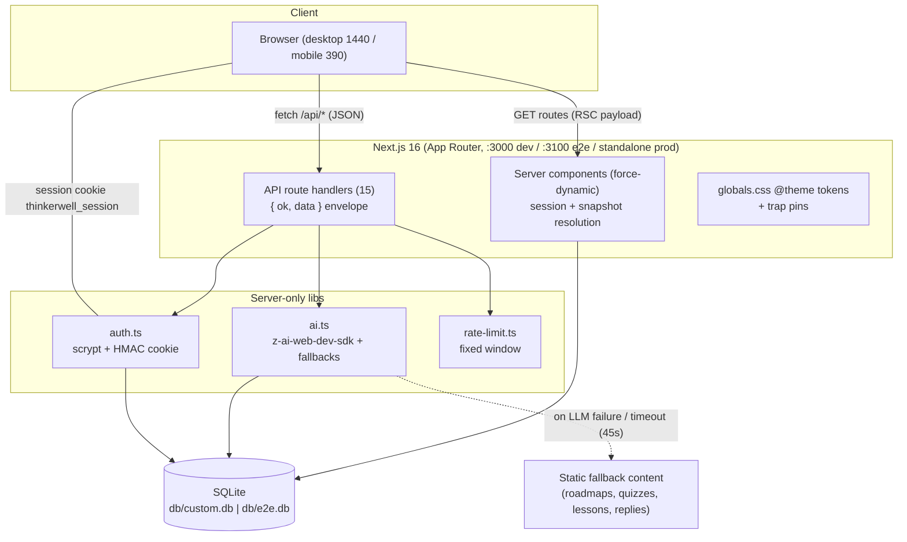
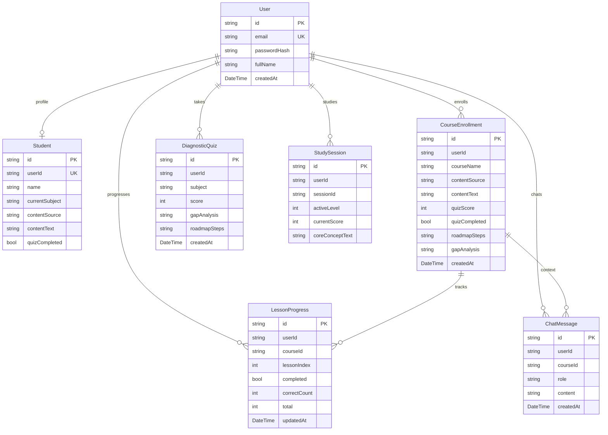

# Thinkerwell (Personalized Tutor App Clone) — Master Project Architecture Document (PAD) v1.2

**Classification:** Internal Engineering Reference
**Status:** DEFINITIVE, PRODUCTION-LOCKED BLUEPRINT
**Companion Document:** [`README.md`](./README.md) (setup/usage) · [`CLAUDE.md`](./CLAUDE.md) (agent conventions) · [`docs/Tailwind-V4-Validation-Report.md`](./docs/Tailwind-V4-Validation-Report.md) (engine trap log)
**Reference App:** https://personalized-tutor-app.base44.app/ (Base44 SaaS, "Thinkerwell")
**Last Updated:** 2026-10-02
**Audience:** Senior Engineers, Tech Leads, DevOps, and Onboarding Engineers
**Rule:** Every architectural decision in this document traces to a specific rationale. Nothing is here "because it's popular."

---

#### Revision Block — v1.2 (Tracked Changes)

- `[SR]` Full clone build: 7 routes, 15 API handlers, 7 Prisma models, AI seam with fallbacks, measured design system, 49 unit + 36 e2e checks.
- `[SAN]` Tailwind v4 engine traps pinned in `globals.css` (five documented differences vs the reference's v3 compiled CSS — see the companion trap log).
- `[AUTH]` Session-cookie `secure` flag derived from request protocol (fixes silent cookie drops on plain-HTTP production boots — the e2e boot caught it).
- `[RES]` Mobile navigation fix: empty toast container made `pointer-events-none` (the live reference ships the bug; Playwright refuses the covered hamburger tap — pinned by `tests/e2e/mobile-navigation.spec.ts`).
- `[S2]` Session-2 parity pass (see `docs/remediation-plan-session-2.md`): the reference's exact 99-line content pool + per-load random bubble picks (server-side prop); the lesson-quiz flow ported to the reference semantics (800 ms auto-advance, retry-later re-queue, 8-to-complete, in-pane "Level Up!" interstitial at stage boundaries with live 1200/800 ms timing); the three confetti presets (`src/lib/confetti.ts` + `canvas-confetti`); Study Streak + Total XP cards (days = min(quizScore,7), XP = pct·10 + score·50); the interactive Daily Challenge modal (upgraded `/api/challenge` returning question/hint/options/correctIndex); conditional Course Progress tint; typewriter topics synced to the reference list; identity sweep (package.json, .env, configs de-ORBITAL'd, `personalized-tutor-app_SKILL.md` replaces the stale scaffold skill).
- `[S3]` Session-3 architecture pass (see `docs/remediation-plan-session-3.md`): the lesson view ported to the reference's decoded gO/yO/xO + Im architecture (subject h2 on level 1 / AI title on 2-3, per-level Core Concept / Real-World Scenario / Final Boss Challenge cards, per-question video + reading content cards, tan 2-column `#E1C8B9` option grid with green/red reveal + CircleCheckBig/CircleX icons, "Next Question" button, 1000 ms reveal → 800 ms advance timing); the hub sidebar's 3-state rows (done/active/locked — the active index drives all three) with the session-scoped "N+1/8" Lesson Progress card (BookOpen icon); per-stage lesson-title suffixes (Basics/In Practice, Fundamentals/Application, Deep Dive/Mastery); the mobile lessons sheet (All Lessons header, black active rows, stage-number-twice labels); subject-icon course cards (keyword-mapped lucide icons, black tiles, Trash2 + ChevronRight, quiz-derived progress); Nori chat question-context prefix (`[Current question: …]` on `/api/chat`); **the quiz-derived progress model** — the reference has no per-lesson entity, so `quizProgressPercent = round(score/5×100)` drives every dashboard/courses number (the demo's 60% = round(3/5·100); the percent clamps at 100, fixing the live's >100% bug); gap_analysis render removed (the live never displays it).

---

## Table of Contents

1. [System Overview & Decisions](#1-system-overview--decisions)
2. [High-Level System Topology](#2-high-level-system-topology)
3. [Application Architecture](#3-application-architecture)
4. [Data Architecture](#4-data-architecture)
5. [The AI Seam](#5-the-ai-seam)
6. [Design System Architecture](#6-design-system-architecture)
7. [Security Architecture](#7-security-architecture)
8. [Testing Strategy](#8-testing-strategy)
9. [Build, Run & Deploy](#9-build-run--deploy)
10. [Developer Handbook](#10-developer-handbook)
11. [Known Issues & Deferred Work](#11-known-issues--deferred-work)

---

## 1. System Overview & Decisions

### 1.1 Document Metadata & Purpose

This PAD is the single source of truth for the Thinkerwell clone. Use it to
understand why the stack is what it is, how a request flows from the yellow
header to SQLite and back, where the AI boundary sits, and which invariants
(gate order, envelope shape, fallback guarantee, mobile-nav fix) must survive
every future change. New engineers should read §1-§4 then §10; reviewers
should read §1.3 (ADRs) and §7; anyone touching CSS must read §6 and the
companion trap log first.

### 1.2 Technology Stack Summary

| Layer | Technology | Version | Key Rationale |
|-------|-----------|---------|---------------|
| Web framework | Next.js (App Router, standalone output) | 16.1 | The reference is a multi-route SPA; App Router routes map 1:1 to reference URLs. Standalone output gives a single-file deploy artifact. |
| UI runtime | React | 19 | Required by Next 16; server components resolve session state without client waterfalls. |
| Language | TypeScript (strict, `noImplicitAny: false`) | 5 | Type safety at the API envelope and DTO seams; the explicit `typecheck` gate compensates for `ignoreBuildErrors` in next.config. |
| Styling | Tailwind CSS (CSS-first `@theme`, no config file) | 4 | The scaffold's engine; token parity with the reference's v3 compiled CSS achieved by pinning (see §6 and the trap log). |
| Database | SQLite | 3 (bundled) | Zero-config self-hosting; the reference's entities map to a small relational schema. |
| ORM | Prisma | 6 | Typed schema, `db push` workflow, schema-relative `file:` URL resolution (tested seam). |
| Auth | Hand-rolled scrypt + HMAC cookie | — | No external auth service; full control of the cookie's `secure` derivation (§7). |
| AI | z-ai-web-dev-sdk (server-only) | 0.0.18 | LLM for roadmap/quiz/lesson/chat generation; every flow degrades to static fallbacks (§5). |
| Unit tests | Vitest | 5 | Fast node-environment tests for the pure domain seams. |
| E2E tests | Playwright | 1.63 | Drives the real standalone build; the only way to pin the mobile-nav interaction. |
| Package runtime | Bun (npm-compatible) | ≥1.1 | The scaffold's script runner; `npm install` works identically. |

### 1.3 Architecture Decision Records (ADRs)

**ADR-001: Real App Router routes, not an SPA rewrite shell**

- **Context:** The reference is a Vite SPA with client-side routing; the
  sibling ORBITAL clone chose one page + rewrites. This app's reference has
  seven distinct, bookmarkable URLs (`/`, `/onboarding`, `/courses`, `/quiz`,
  `/hub`, `/demo`, `/login`) with distinct document titles.
- **Decision:** One App Router folder per route. Server components resolve
  the session and a serializable snapshot; a single client shell per route
  owns interactivity.
- **Rationale:** Next.js handles the URL ↔ view mapping natively; no custom
  router seam to drift; per-route `force-dynamic` keeps auth redirects
  server-side; page titles match the reference exactly.
- **Consequences:** ✅ Bookmarkable parity, simpler mental model, natural
  code-splitting. ❌ Route transitions are full navigations (fine for this
  app's scale); duplicated desktop/mobile DOM in the Hub (documented locator
  rule in §8).
- **Alternatives rejected:** Single page + `rewrites()` (ORBITAL pattern) —
  rejected: the router seam is a maintenance liability when the reference
  has real routes; Next's rewrite table drifts from the client store.

**ADR-002: SQLite + Prisma with a tested path-resolution seam**

- **Context:** Self-hosters must clone-and-run with zero services; the
  Prisma CLI resolves relative `file:` URLs against `schema.prisma`, but the
  Next standalone server rewrites module paths — a naive relative URL
  resolves differently per runtime.
- **Decision:** SQLite via Prisma; `src/lib/db-path.ts` anchors resolution
  (standalone detector → module repo root → CWD), pinned by
  `tests/db-path.test.ts`; `db.ts` imports the seam and exports one client.
- **Rationale:** One database file for dev, build, standalone, and e2e (which
  swaps `DATABASE_URL` for its own `db/e2e.db`). PostgreSQL remains a
  `provider` swap away for hosted deploys.
- **Consequences:** ✅ Zero-config; deterministic path behavior under every
  runtime. ❌ Single-writer SQLite (fine at tutoring-app scale); e2e and dev
  need separate seed runs.
- **Alternatives rejected:** PostgreSQL by default — rejected for
  clone-and-run friction; an env-var absolute path — rejected as
  copy-paste-hostile.

**ADR-003: Hand-rolled cookie auth with protocol-derived `secure`**

- **Context:** The clone must boot in dev (HTTP), in e2e (production build
  on plain HTTP :3100), and in real HTTPS deploys. NextAuth was never in the
  scaffold; the ORBITAL doctrine (scrypt + HMAC stateless cookie) is
  battle-tested.
- **Decision:** `src/lib/auth.ts`: scrypt password hashes (16-byte salt),
  HMAC-SHA256-signed `{uid, iat}` cookie (`thinkerwell_session`, 7-day TTL),
  `createSession(userId, req?)` deriving `secure` from `req.url` then
  `x-forwarded-proto` — defaulting to NOT secure unless HTTPS is provable.
- **Rationale:** An env-based `secure: NODE_ENV === "production"` silently
  drops cookies on plain-HTTP production boots — the exact bug that failed
  every authenticated e2e test until traced (a 2-cycle debug cost, now an
  invariant).
- **Consequences:** ✅ Works under every transport; no auth dependency;
  timing-safe comparisons. ❌ In-process rate limiting only (single-node
  deploy); no OAuth (Google button degrades with an explanatory notice —
  documented deviation).
- **Alternatives rejected:** NextAuth — rejected: no platform lock-in, and
  the cookie-transport control matters more than features; JWTs — rejected:
  revocation story worse than a signed stateless payload at this scale.

**ADR-004: The AI seam — real LLM, deterministic fallbacks, one validation gate**

- **Context:** The reference's core flows (roadmap, diagnostic quiz, lesson
  content, Nori chat) are LLM-generated; a self-hosted clone may run without
  LLM credentials, and LLMs return malformed JSON.
- **Decision:** `src/lib/ai.ts` wraps `z-ai-web-dev-sdk` behind seven typed
  generators; each validates the parsed shape (extract-JSON helper, option
  counts, index bounds) and falls back to deterministic static content;
  `aiGenerated` flags ride the API responses.
- **Rationale:** The product must never hard-fail on an AI outage; the UI
  surfaces degradation via toast ("the AI tutor is offline — using the
  built-in roadmap"). One validation gate for LLM and fallback output keeps
  the client dumb.
- **Consequences:** ✅ Flows always terminate; e2e can assert shapes without
  mocking the LLM; fallback quizzes are pedagogically sane. ❌ Fallback
  content is generic (acceptable — the z-ai SDK is present in the target
  environment); 45s AI timeouts add latency ceilings (documented in test
  timeouts).
- **Alternatives rejected:** Require credentials — rejected: breaks the
  zero-config promise; client-side LLM calls — rejected: key exposure.

**ADR-005: Tailwind v4 with pinned v3 parity tokens**

- **Context:** The reference's compiled CSS is Tailwind v3; the scaffold
  runs v4, whose engine differs in five measured ways (palette drift via
  oklch, shadow-scale shift, gradient interpolation in oklab, `space-y`
  selector rewrite, bare-HSL transparent resolution under `@theme inline`).
- **Decision:** CSS-first `@theme` in `globals.css` with full-hex brand
  tokens, the v3 slate hexes pinned, `--shadow-sm` pinned to v3 geometry,
  gradients shipped as arbitrary sRGB values, and the toaster
  pointer-events fix.
- **Rationale:** Byte-identical class attributes must compute identically
  across engines; the trap log (companion doc) documents each measured
  difference and the pin that neutralizes it.
- **Consequences:** ✅ Visual parity without an engine downgrade; the pins
  are grep-able invariants. ❌ Future v4 updates may shift more tokens — the
  trap log is the regression checklist.
- **Alternatives rejected:** Tailwind v3 — rejected: the scaffold and
  sandbox toolchain standardize on v4; `@theme inline` for brand colors —
  rejected: bare-triplet hazard documented in the trap log.

**ADR-006: Playwright e2e against the production standalone build**

- **Context:** Dev-mode React StrictMode double-rendering and dev overlays
  poison computed-style assertions; the mobile-nav pin requires REAL
  hit-testing (covered-element rejection).
- **Decision:** `playwright.config.ts` boots `bun .next/standalone/server.js`
  on :3100 with its own seeded `db/e2e.db`; a "setup" project signs the demo
  user once (storageState) so the rate limiter never trips mid-suite.
- **Rationale:** The production artifact is what ships; testing it catches
  build-only defects (the cookie-secure bug was invisible in dev). The
  storageState budget is a hard constraint (10 logins/15 min/IP).
- **Consequences:** ✅ High-fidelity assertions, honest interaction pins.
  ❌ `bun run build` prerequisite; one worker (shared SQLite file); file-level
  storageState scoping requires logged-out specs to live in their own file
  (a documented pitfall).
- **Alternatives rejected:** Dev-server e2e — rejected: overlay + hydration
  noise; component tests only — rejected: the mobile-nav regression is
  exactly the class only a real browser catches.

---

## 2. High-Level System Topology



**Scaling characteristics:** single Node process, single SQLite file
(single-writer — adequate for a tutoring app's concurrency). The in-memory
rate limiter is per-process; a multi-node deploy needs a shared store (§11).

---

## 3. Application Architecture

### 3.1 The Layer Model

```
Layer 0: Routes (src/app/**/page.tsx) — resolve session + snapshot server-side,
         redirect unauthenticated traffic. Rule: NEVER fetch client-side for
         first render; the snapshot IS the props.
Layer 1: Client shells (src/components/*/*-app.tsx) — "use client"; own all
         interactivity (menus, tabs, forms, typewriter). Rule: mutations go
         through the API then refresh state; no client stores.
Layer 2: API route handlers (src/app/api/**/route.ts) — validate input,
         enforce session + ownership, answer in the { ok, data } envelope.
         Rule: no business logic beyond orchestration.
Layer 3: Server-only libs (src/lib/auth.ts, ai.ts, rate-limit.ts, db.ts) —
         the only code that touches secrets, the SDK, and Prisma.
Layer 4: Pure domain (src/lib/domain.ts, quotes.ts, api.ts types) — no I/O;
         unit-tested. Rule: if logic can be pure, it must be.
```

**Golden Rule:** data flows down (routes → shells), mutations flow up
(shells → API → libs → DB), and nothing skips a layer — shells never import
Prisma, libs never import React.

### 3.2 Annotated Directory Structure

```
📂 prisma/
 ├── 📄 schema.prisma          # 7 models; SQLite provider; env DATABASE_URL
 └── 📄 seed.ts                # idempotent: wipe + demo account + Economics course
📂 public/
 ├── 📄 mascot-desktop.svg    # 160×210 hero mascot (breathe/arm/hair keyframes)
 ├── 📄 mascot-mobile.svg     # 90×118 hero variant
 ├── 📄 mascot-welcome.svg    # 80×105 welcome-card variant
 ├── 📄 mascot-quiz-gen.svg   # 120×108 generating-state mascot
 ├── 📄 nori-avatar.svg       # chat avatar (renders at 24/36px)
 └── 📄 logo.svg              # 33px header brand mark
📂 src/app/
 ├── 📄 layout.tsx            # root: Google Fonts link (Funnel Sans + Eczar)
 ├── 📄 globals.css           # ALL tokens + trap pins + toaster fix (§6)
 ├── 📄 page.tsx              # "/" — onboarding or course dashboard (force-dynamic)
 ├── 📂 login/                # slate card; renders for every visitor
 ├── 📂 onboarding/           # ALWAYS the setup state (Add-a-Course surface)
 ├── 📂 courses/              # courses list + delete + empty state
 ├── 📂 quiz/                 # 7-question diagnostic; error state w/o student
 ├── 📂 hub/                  # learning workspace: ?course= & ?lesson= params
 ├── 📂 demo/                 # stateless guest mirror (demoPercent={60})
 └── 📂 api/                  # 15 route handlers (see §4.2)
📂 src/components/
 ├── 📄 mascot.tsx            # <Image unoptimized> wrappers for the SVGs
 ├── 📄 toast.tsx             # Sonner-compatible layer; pointer-events FIXED
 ├── 📂 layout/app-header.tsx # yellow chrome; desktop pill + mobile hamburger
 ├── 📂 dashboard/            # dashboard-app (state switch) / onboarding / course / demo
 ├── 📂 hub/                  # hub-app (3-pane + mobile tabs) / nori-chat / lesson-view
 ├── 📂 quiz/quiz-app.tsx     # question cards + preparing overlay
 ├── 📂 courses/courses-app.tsx
 └── 📂 login/login-card.tsx  # sign-in / sign-up / google-degradation
📂 src/lib/
 ├── 📄 db.ts + db-path.ts    # Prisma singleton + tested path resolution
 ├── 📄 auth.ts               # scrypt + HMAC; protocol-derived secure flag
 ├── 📄 api.ts                # ok()/fail() envelope + readJson guard
 ├── 📄 ai.ts                 # 7 generators + static fallbacks + extractJson
 ├── 📄 domain.ts             # mastery grid, roadmap parsing, progress math (PURE)
 ├── 📄 quotes.ts             # daily quote rotation + encouragements (PURE)
 ├── 📄 rate-limit.ts         # fixed-window limiter
 └── 📄 utils.ts              # cn() (clsx + tailwind-merge)
📂 tests/
 ├── 📄 domain.test.ts        # 18 checks: grid, parsing, progress, quotes
 ├── 📄 db-path.test.ts       # 15 checks: URL resolution anchors
 └── 📂 e2e/                  # auth / header / dashboard / mobile-navigation specs
📂 docs/
 ├── 📄 Tailwind-V4-Validation-Report.md   # the five engine traps (READ FIRST)
 ├── 📄 how-to-git-push-using-ssh-wrapper_SKILL.md
 ├── 📄 ssh_git_wrapper_v3.py # the push wrapper itself
 └── 📂 screenshots/          # 15 captured states (desktop + mobile)
```

### 3.3 Critical Code Patterns

**Pattern 1 — The page snapshot (server → client contract)**

```ts
// src/app/page.tsx (abbreviated) — Layer 0 resolves EVERYTHING the shell needs.
export const dynamic = "force-dynamic";
export default async function HomePage({ searchParams }) {
  const user = await getSessionUser();
  if (!user) redirect("/login?from_url=%2F");        // server-side guard
  const [student, enrollments] = await Promise.all([/* db reads */]);
  const current = /* ?course= param || first enrollment */;
  return <DashboardApp user={…} courses={…} currentCourse={current} />;
}
```

*Why this pattern:* the client shell never races the server for first paint;
auth redirects happen before a byte of app UI ships. Every route follows it
(`/hub`, `/quiz`, `/courses`, `/onboarding`).

**Pattern 2 — The API envelope**

```ts
// src/lib/api.ts — the ONLY response shape; the client's fetch wrapper
// (inline in shells) branches on json.ok and surfaces error.message.
export function ok<T>(data: T, status = 200) {
  return NextResponse.json({ ok: true, data } satisfies ApiOk<T>, { status });
}
export function fail(code: string, message: string, status = 400) { … }
```

*Why this pattern:* one discriminated union across 14 handlers; error codes
are stable strings (`UNAUTHORIZED`, `RATE_LIMITED`, `AI_UNAVAILABLE`, …)
the UI can branch on without string matching messages.

**Pattern 3 — AI generation with fallback (the never-fail guarantee)**

```ts
// src/lib/ai.ts (abbreviated) — validation gate, then fallback.
const parsed = extractJson<StageDraft[]>(raw);            // strips fences, finds JSON
if (parsed && parsed.length >= 3 && parsed.every(validStage)) {
  return { stages: parsed.slice(0, 3), aiGenerated: true };
}
return { stages: fallbackStages(courseName), aiGenerated: false };
```

*Why this pattern:* the LLM is an untrusted external system (§9 of the
operating doctrine): its output is validated exactly like user input, and a
deterministic fallback keeps the flow terminating. The `aiGenerated` flag
lets the UI toast honest degradation.

**Pattern 4 — The mobile-nav fix (an invariant, not a style)**

```css
/* globals.css — the live app ships this BROKEN: its empty toaster covers
   the hamburger (Playwright refuses the tap). Container is inert; only
   toasts are interactive. */
[data-sonner-toaster], [data-sonner-toaster] > * { pointer-events: none; }
[data-sonner-toaster] [data-sonner-toast]      { pointer-events: auto; }
```

*Why this pattern:* the toast portal must exist (Sonner-compatible
placement) but must never intercept pointer events while empty. Pinned by
`mobile-navigation.spec.ts`'s real `.tap()` on the hamburger.

---

## 4. Data Architecture

### 4.1 Database Schema



**Key invariants:**

- `Student` is 1:1 with `User` (unique `userId`); `quizCompleted` gates the
  roadmap-producing step.
- `CourseEnrollment.roadmapSteps` is a JSON string of exactly 3
  `{ title, description }` stages; `parseRoadmap()` is defensive (invalid
  JSON → `[]`; >3 stages truncated). One user may hold many enrollments
  (course switcher).
- `LessonProgress` is unique on `(userId, courseId, lessonIndex)` —
  0..5 mapping onto stage 0..2 × level 0..1 (the mastery grid).
- Deletes cascade from `User`; `CourseEnrollment` delete cascades its
  progress and chat rows.

### 4.2 API Surface (14 handlers)

| Method & Path | Body → Result | Notes |
|---|---|---|
| `POST /api/auth/login` | `{email,password}` → user | rate-limited 10/15min/IP; sets cookie |
| `POST /api/auth/register` | `{email,password,fullName?}` → user | same limit; 8-char minimum |
| `POST /api/auth/logout` | — → `{loggedOut}` | clears cookie |
| `GET /api/auth/me` | — → `{user\|null}` | session probe |
| `GET/PUT /api/student` | profile upsert | PUT is the preferences surface |
| `GET /api/courses` | → enrollments + progress | ordered by createdAt desc |
| `POST /api/courses` | `{courseName,…}` → enrollment | "Try it" sample path |
| `DELETE /api/courses/[id]` | → `{deleted}` | owner-checked |
| `POST /api/courses/generate` | `{mode,topic\|courseName,contentText}` → `{courseId,roadmap}` | the onboarding Continue; AI + fallback |
| `POST /api/quiz/generate` | `{courseId}` → 7 questions | AI + fallback |
| `POST /api/quiz/submit` | `{courseId,answers}` → `{score,roadmap,redirectTo}` | writes gap analysis + DiagnosticQuiz row |
| `POST /api/lessons/content` | `{courseId,lessonIndex}` → lesson + 8 questions | AI + fallback |
| `POST /api/progress` | `{courseId,lessonIndex,correct,total}` → upsert | unique-constraint upsert |
| `POST /api/chat` | `{message,courseId?}` → `{reply}` | persists both messages; history window 20 |
| `GET /api/health` | → `{status,db}` | e2e webServer wait condition |
| `POST /api/challenge` | — → daily question | AI + fallback |

All domain routes: `requireSession()` → 401 when missing; ownership checks
on every `[id]`-bearing handler; bodies capped at 1 MB (`readJson`).

### 4.3 Persistence Strategy

- No connection pooling (SQLite file); one `PrismaClient` singleton via the
  global registry (dev hot-reload safe).
- `db push` (no migrations directory) — schema drift is intentional for a
  clone; the seed is idempotent and wipes domain tables.
- E2E swaps `DATABASE_URL=file:../db/e2e.db`; the global setup pushes +
  seeds it per run.

---

## 5. The AI Seam

| Flow | Prompt shape (server-only) | Fallback |
|---|---|---|
| Course roadmap | "Create exactly 3 progressive learning stages…" → JSON array | 3 generic stages (Foundations/Application/Mastery) |
| Diagnostic quiz | 7 MCQs, 4 options, `correctIndex` | 7 learning-strategy questions |
| Lesson content | core concept + 8 MCQs for `{subject} lesson N ({focus})` | per-lesson concept + 8 fixed-shape questions |
| Nori chat | system persona (Socratic, concise, warm) + last 6 turns | a guiding question |
| Gap analysis | 2-3 sentences from `{score}/7` | level-labeled canned analysis |
| Daily challenge | 1 MCQ | the monopoly question (reference parity) |

**Contract:** every generator validates LLM JSON through
`extractJson` (fence-stripping + first-array/object slicing) and shape
checks BEFORE use; failures and the 45s timeout route to the fallback;
`aiGenerated` flags ride responses so the UI can toast "the AI tutor is
offline". The SDK never appears in client bundles (`import "server-only"`
guard).

---

## 6. Design System Architecture

**Token inventory** (`globals.css` `@theme`, full hex — trap 1):

| Token | Hex | Measured on |
|---|---|---|
| `--color-ink` | `#0f0e0e` | app gutters, primary text, dark tab bar text |
| `--color-yellow` | `#fffd73` | header, progress cards, active tab chip, quote sub-card |
| `--color-paper` | `#f8f8f8` | content cards |
| `--color-purple` | `#c8aeff` | setup panel, Course Lessons panel |
| `--color-lilac` | `#d2c0f9` | hub lessons sidebar |
| `--color-bubble` | `#ebe2ff` | mascot speech bubble |
| `--color-tan` | `#e1c8b9` | "Enter The Hub" CTA |
| `--color-gray-body` | `#595959` | secondary text (font-light) |
| `--color-gray-chat` | `#f0f0f0` | chat bubbles + input |
| `--color-bar` | `#1a1a1a` | mobile hub bottom tab bar |

Plus the pinned v3 slate ramp (login surface), `--shadow-sm: 0 1px 2px 0
rgb(0 0 0 / 0.05)` (trap 5), Funnel Sans / Eczar font tokens, and custom
utilities: `caret-blink` (typewriter), `animate-fade-in-up`, `video-shimmer`,
`tag-btn` (subject reveal on hover — mirrors the reference's inline style
block), `scroll-slim`.

**Layout grammar:** `min-h-screen flex flex-col` on `#0F0E0E` → header
`mx-[4px] rounded-b-[20px]` → content `flex-1 gap-[4px] px-[4px] pb-[4px]
pt-[4px]` → `rounded-[20px]` cards. H1 scale `clamp(64px, 4.5vw, 120px)`
ls `-0.03em` lh 0.9; hero topic `clamp(40px, 7vw, 140px)` with the blink
caret. Buttons: `rounded-[12px]` (form), Continue `bg-black text-white
font-bold disabled:opacity-30`.

**The five engine-trap pins** — full evidence in
`docs/Tailwind-V4-Validation-Report.md`: (1) full-hex `@theme` values; (2)
v3 slate hexes pinned; (3) hero/login gradients as arbitrary
`bg-[linear-gradient(…)]`/`bg-gradient-to-br` with pinned stops; (4) no
explicit-margin children inside `space-y-*`; (5) `--shadow-sm` at v3
geometry. Plus the global `button, [role="button"] { cursor: pointer }`
base rule (v4 preflight sets none) and the toaster pointer-events rules.

---

## 7. Security Architecture

| Control | Implementation | Boundary |
|---|---|---|
| Password storage | scrypt (N default, 64-byte, 16-byte salt) + `timingSafeEqual` | `src/lib/auth.ts` |
| Sessions | HMAC-SHA256-signed `{uid,iat}` cookie, httpOnly, SameSite=Lax, 7-day TTL, `secure` protocol-derived | `src/lib/auth.ts` |
| Input validation | manual trim/length/enum/ownership on every handler; 1 MB body cap | `src/lib/api.ts` + handlers |
| AuthZ | ownership checks on all `[id]` routes (404 on foreign ids) | handlers |
| Rate limiting | fixed window, 10/15min/IP on login+register, in-process | `src/lib/rate-limit.ts` |
| Secrets | `AUTH_SECRET` env (32+ hex in prod; documented dev fallback), never committed; `.gitignore` covers `.env`, `*.key`, `ssh-key.txt` | repo root |
| AI output | treated as untrusted input — shape-validated before persistence | `src/lib/ai.ts` |
| Headers | framework defaults + standalone output; no CSP customization yet (deferred, §11) | next.config.ts |
| LLM key exposure | SDK confined to server-only modules | `import "server-only"` |

**Known accepted deviations:** Google OAuth renders but degrades with an
explanatory notice (no credentials in a self-hosted clone); rate limiting is
per-process (single-node doctrine).

---

## 8. Testing Strategy

| Layer | Tool | Scope | Count |
|---|---|---|---|
| Pure domain | Vitest (`tests/domain.test.ts`, `tests/db-path.test.ts`) | mastery grid, roadmap parsing, titles, progress math, quotes, URL anchors | 33 |
| E2E — auth surface | Playwright (`auth.spec.ts`, logged-out storageState) | redirects, card structure, bad credentials, signup → onboarding | 6 |
| E2E — header chrome | `header.spec.ts` (authenticated) | user menu, email, logout, yellow tokens, Eczar wordmark | 3 |
| E2E — dashboard | `dashboard.spec.ts` | stats grid, 67% honest math, quote bubble tokens, Hub panes, Nori reply + persistence, courses, demo 60% pin | 12 |
| E2E — mobile nav | `mobile-navigation.spec.ts` (390×844, touch) | **hamburger tappable (the regression pin)**, menu structure, hub tab bar colors, tab switching | 8 |

**Conventions:**

- Gate order (the only CI): `lint → typecheck → test → build → test:e2e`.
  `next.config.ts` sets `ignoreBuildErrors` — the typecheck step is the type
  gate; never skip it.
- The Hub renders desktop AND mobile instances in one DOM — locators use
  `.first()` (desktop) / `.last()` (mobile instance); the DOM order is
  asserted implicitly by the tab tests.
- File-level `test.use({ storageState })` scopes the WHOLE file — logged-out
  specs must live in their own file (the scoping bug that cost a debug
  cycle).
- AI-dependent assertions carry 45-60s timeouts; the fallback guarantee
  makes them terminate.

---

## 9. Build, Run & Deploy

```bash
bun install && cp .env.example .env
bun run db:push && bun run db:seed     # db/custom.db + demo account
bun run dev                             # :3000, dev.log via tee
bun run lint && bun run typecheck && bun run test
bun run build                           # standalone → .next/standalone
bun run start                           # production server (from repo root)
bun run test:e2e                        # :3100 against db/e2e.db
```

- **Dev-origin protection:** `allowedDevOrigins` in `next.config.ts` covers
  localhost, 127.0.0.1, and the sandbox preview host — without it Next 16
  blocks dev chunks for foreign origins (unhydrated pages).
- **Standalone quirk:** `outputFileTracingRoot` is pinned; the server must
  start from the repo root (SQLite path anchoring, §ADR-002).
- **Production env:** `AUTH_SECRET=$(openssl rand -hex 32)`; an absolute
  `DATABASE_URL` is recommended for deploys outside the repo; terminate TLS
  at a proxy that sets `x-forwarded-proto` (the cookie picks up `secure`
  automatically).
- **Pushing:** `python3 docs/ssh_git_wrapper_v3.py --key-file <0600 key>
  --remote git@github.com:nordeim/personalized-tutor-app.git` — the wrapper
  verifies the remote ref and shreds the key (runbook in docs/).

---

## 10. Developer Handbook

**Adding a domain field** (e.g. a course `difficulty`):
1. `prisma/schema.prisma` → `bunx prisma generate && bun run db:push`.
2. Pure logic (validation/derivation) → `src/lib/domain.ts` with a failing
   Vitest test first.
3. API handler: validate + persist + envelope; ownership check if id-bearing.
4. Route page snapshot → client shell prop; render with measured tokens.
5. Full gate; add/extend the e2e assertion in the owning spec.

**Adding an AI flow:** extend `src/lib/ai.ts` (typed generator + fallback +
`extractJson` validation + 45s timeout), surface `aiGenerated` in the
response, toast degradation in the shell. Never call the SDK from a client
component.

**Styling a new surface:** read `docs/Tailwind-V4-Validation-Report.md`,
reuse tokens from `@theme` (no raw hexes in components — the measured
exceptions carry `style` attributes with comments), respect the gutter
grammar (§6), and check mobile at 390×844 (the Hub's dual-DOM rule applies
to any new desktop+mobile component).

**Debugging playbook:**
- Auth redirects in e2e but not dev → the cookie `secure` derivation (§7) —
  check `x-forwarded-proto`/req.url.
- Playwright "element covered" → an overlay stole pointer events; check the
  toaster rules (§3.3 Pattern 4).
- Strict-mode locator violations → the Hub dual-DOM order (§8).
- AI flow hangs → the 45s timeout + fallback; check the SDK availability.

---

## 11. Known Issues & Deferred Work

| ID | Item | Severity | Note |
|----|------|----------|------|
| K-1 | In-process rate limiting | Low | single-node doctrine; swap for Redis-backed at multi-node |
| K-2 | No CSP/security-header customization | Low | framework defaults; add before public hosting |
| K-3 | Hub lesson content is AI-per-visit (not persisted) | Medium | intentional parity with the reference; persisting would enable offline review |
| K-4 | `noImplicitAny: false` | Low | scaffold default; tightening is a mechanical pass |
| K-5 | Multipart file upload reads text only | Low | PDF/DOCX extraction deferred; text paste + .txt/.md fully supported |
| K-6 | Dev-mode e2e impossible | Info | by design (ADR-006); the standalone boot is the tested artifact |

*Deferred work is listed so the next agent knows what was intentionally
left — each item is a scoped follow-up, not an oversight.*
