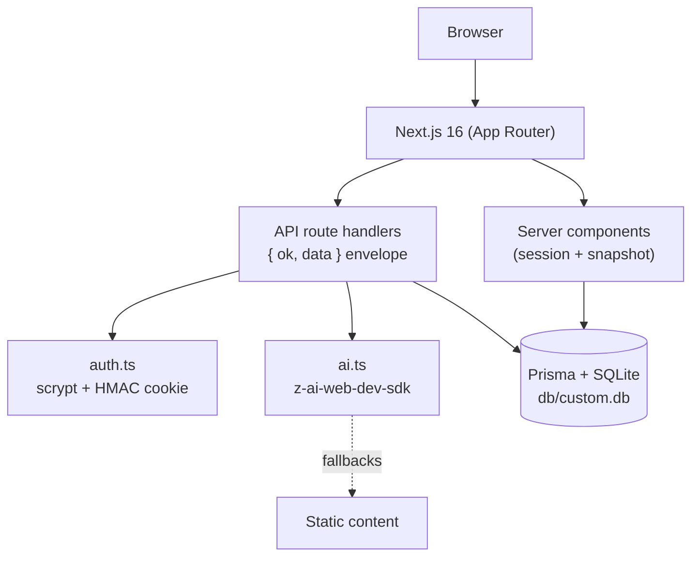

# Thinkerwell — Personalized Tutor App

      

**A self-hosted, production-grade clone of the base44 Personalized Tutor App (Thinkerwell) — an AI tutoring partner that uses the Socratic method to build personalized learning paths, find knowledge gaps, and coach learners through a 3-level mastery grid.**

The reference app is a closed SaaS (base44) whose entity writes are locked behind platform auth; this clone reproduces the full experience — onboarding, AI course generation, the diagnostic quiz with gap analysis, the learning Hub with the Nori chat tutor, and progress tracking — on a stack you own: one Next.js 16 app, a SQLite database, and an AI seam that degrades gracefully when the LLM is unavailable.

## Features

| | Feature | Where |
|---|---------|-------|
| 🔐 | Email/password auth (scrypt + HMAC cookie sessions, rate-limited) | `src/lib/auth.ts` + `/api/auth/*` |
| 🧭 | Onboarding dashboard: typewriter hero (reference topic list), mode cards, category tags | `/` + `/onboarding` |
| 🤖 | AI course generation: 3-stage roadmap from any topic or pasted material | `/api/courses/generate` |
| 📝 | Diagnostic quiz: 7 AI questions → gap analysis → roadmap, confetti at 3/7 correct | `/quiz` |
| 📚 | Course dashboard: welcome hero, progress stats, daily challenge modal, learning roadmap | `/?course=<id>` |
| 🎓 | The Hub: desktop three-pane (lessons sidebar / Nori chat / lesson content), mobile Learn·Ask Nori·Lessons tab shell | `/hub` |
| 💬 | Nori, the Socratic AI tutor — persistent chat history per course | `/api/chat` |
| 🗛 | The reference's exact 99-line quote pool, random pick per page load | `src/lib/quotes.ts` |
| 🪟 | The Q5 "Add a Course" in-page modal: Build/Material mode cards, 6 quick tags, Paste Text/Upload File tabs, Start Assessment → `/quiz?course=` | `src/components/courses/add-course-modal.tsx` |
| 🅿️ | The reference's two-dropdown header: bordered Course pill (p_) + m_ user menu with the course context line and inline Update Preferences (PUT /api/student) | `src/components/layout/app-header.tsx` |
| ✅ | Lesson quizzes ported to the reference flow: 1000 ms reveal + auto-advance, retry-later re-queue, 8-to-complete | `src/components/hub/lesson-view.tsx` |
| 🃏 | The reference's tan 2-column option grid, per-level context cards, and per-question video/reading content cards | `src/components/hub/lesson-view.tsx` |
| 🧭 | The quiz-derived progress model (the live has no per-lesson entity): round(score/5×100) → lessons → stages | `src/lib/domain.ts` |
| 🎉 | Confetti moments: level-up burst, dual-cannon course completion, quiz milestones | `src/lib/confetti.ts` |
| 🔥 | Study Streak + Total XP cards (the reference's gamification column) | `src/components/dashboard/course-dashboard.tsx` |
| 🖼️ | Pixel-measured design system: yellow chrome, purple setup panel, animated mascot | `src/app/globals.css` + `public/*.svg` |
| 👻 | Guest demo route with the reference's sample Economics course | `/demo` |
| 🧪 | 69 unit tests + 46 Playwright e2e checks (incl. the mobile-nav regression pin) | `tests/` |

## Architecture

| Layer | Technology | Purpose |
|-------|-----------|---------|
| Framework | Next.js 16 (App Router, standalone output) | Server components resolve state; client components own interactivity |
| Language | TypeScript 5 (strict) | End-to-end types, explicit `typecheck` gate |
| Styling | Tailwind CSS v4 (CSS-first `@theme`, no config file) | Measured token system with v4 engine-trap pins |
| Database | SQLite + Prisma 6 | Zero-config persistence; schema-relative `file:` URL resolution |
| Auth | Hand-rolled scrypt + HMAC-signed cookie | No external auth dependency; 7-day sessions |
| AI | `z-ai-web-dev-sdk` (server-only) | Roadmap/quiz/lesson/chat generation with static fallbacks |
| Tests | Vitest (unit) + Playwright (e2e, standalone server on :3100) | The only CI — the local gate is the gate |



## File Hierarchy

```
📂 prisma                  schema.prisma (7 models) + idempotent seed
📂 public                  mascot.svg, logo.svg (extracted from the live app)
📂 src/app                 routes: /, /login, /onboarding, /courses, /quiz, /hub, /demo
 │  └─ 📂 api              15 route handlers (auth, courses, quiz, lessons, chat, progress, challenge, health)
 ├── 📄 globals.css        Tailwind v4 @theme tokens + the five engine-trap pins + toaster fix
 ├── 📄 layout.tsx         Root layout: Google Fonts (Funnel Sans + Eczar)
📂 src/components
 ├── 📂 layout             app-header.tsx (Course pill + user menu dropdowns, mobile hamburger)
 ├── 📂 dashboard          onboarding / course / demo shells (the demo runs the guest-mode header)
 ├── 📂 hub                hub-app.tsx, nori-chat.tsx, lesson-view.tsx
 ├── 📂 quiz               quiz-app.tsx (7-question diagnostic)
 ├── 📂 courses            courses-app.tsx + add-course-modal.tsx (the Q5 port)
 ├── 📂 login              login-card.tsx (slate surface, sign-in/up modes)
 └── 📄 mascot.tsx         SVG wrappers, toast.tsx (Sonner-compatible, pointer-events fixed)
📂 src/lib                 api.ts, auth.ts, ai.ts, domain.ts (pure mastery grid), db.ts, db-path.ts, quotes.ts, rate-limit.ts
📂 tests                   domain.test.ts + e2e/ (Playwright specs incl. mobile-navigation.spec.ts)
📄 docs/                   Tailwind-V4-Validation-Report.md, ssh push runbook, screenshots/
```

## Quick Start

Prerequisites: **Node.js ≥ 20** (or Bun ≥ 1.1), no external services.

```bash
bun install                      # or: npm install
cp .env.example .env             # defaults are fine for local dev
bun run db:push                  # create db/custom.db from the schema
bun run db:seed                  # demo account + sample Economics course
bun run dev                      # http://localhost:3000
```

**Verify setup**

```bash
curl -s localhost:3000/api/health        # {"ok":true,"data":{"status":"ok","db":true}}
bun run lint && bun run typecheck && bun run test   # all green
```

Open http://localhost:3000 and sign in with the demo account:
**`demo@thinkerwell.app` / `Demo1234!`** — or watch the guest experience at
`/demo`, or register a fresh account and run the full
topic → diagnostic quiz → AI-generated course flow.

**Demo login:** `demo@thinkerwell.app` / `Demo1234!`

## Environment Variables

| Variable | Purpose | Required |
|----------|---------|----------|
| `DATABASE_URL` | SQLite `file:` URL (relative resolves against `prisma/schema.prisma`); or a PostgreSQL string | ✅ |
| `AUTH_SECRET` | HMAC key for session cookies (`openssl rand -hex 32`); insecure dev fallback when unset | in prod |
| `NEXT_PUBLIC_SITE_URL` | Canonical origin for metadata | optional |

## Testing

```bash
bun run test          # 69 Vitest unit checks (domain grid, quote pool, gamification math, quiz-derived progress, db-path, source-predicate split)
bun run build         # standalone production build (e2e prerequisite)
bun run test:e2e      # 46 Playwright checks against the standalone server on :3100
                      # boots its own db/e2e.db (pushed + seeded by the global setup)
```

The e2e suite covers: the auth surface (login, signup, bad credentials,
redirects), the yellow header chrome, the course dashboard (incl. the
Study Streak + Total XP cards and the challenge modal), the Hub panes, the
lesson-quiz flow (auto-advance + retry modal), Nori chat persistence, the
courses page, the guest demo — and the **mobile-navigation regression pin**
(390×844): the empty toast layer must stay `pointer-events-none` so the
hamburger menu stays tappable. The live reference ships this bug; the clone
fixes it and the spec proves it.

## The Tailwind v4 trap log

This clone pins five v3→v4 engine differences discovered while porting the
reference's byte-identical class attributes — full report in
[`docs/Tailwind-V4-Validation-Report.md`](docs/Tailwind-V4-Validation-Report.md):

1. Full-hex theme vars (bare HSL triplets resolve transparent under v4)
2. v3 palette hexes pinned (v4's oklch defaults drift 1-3 sRGB units)
3. Gradients ship as sRGB-equivalent arbitrary values (v4 interpolates oklab)
4. `space-y-*` children with explicit margins render differently — avoid the combo
5. `--shadow-sm` pinned to the v3 geometry (v4 shifted the scale one notch)

Plus the mobile-nav toaster fix: the notifications container is
`pointer-events-none` (items restore `auto`), so an empty toast layer can
never cover the header's hamburger button.

## The session-2 parity pass

A second audit against the live bundle
([`docs/remediation-plan-session-2.md`](docs/remediation-plan-session-2.md))
closed the remaining behavioral gaps: the typewriter topic list, the exact
99-line quote pool with per-load random picks, the lesson-quiz flow
(auto-advance, retry-later re-queue, 8-to-complete), the three confetti
moments, the Study Streak + Total XP cards, the interactive Daily Challenge
modal, and the conditional Course Progress tint. Every one of them is mined
verbatim from the reference and pinned by tests.

## The session-3 architecture pass

A third audit ([`docs/remediation-plan-session-3.md`](docs/remediation-plan-session-3.md))
decoded the reference's actual component functions from the bundle and
ported them wholesale: the lesson view's gO/yO/xO level layouts (subject h2
on level 1, per-level context cards) + Im per-question content cards
(video shimmer + reading cards), the tan 2-column option grid with
"Next Question", the hub sidebar's 3-state rows (done/active/locked), the
session-scoped "{answered + 1}/8" Lesson Progress card, the per-stage
lesson-title suffixes, the mobile lessons sheet, and the subject-icon course
cards — plus the biggest semantic discovery: the reference's dashboard
progress is QUIZ-DERIVED (`round(score/5×100)`), which is exactly why its
demo shows 60% with a 3/7 quiz score.

## The session-5 chrome-polish pass

A fifth audit ([`docs/remediation-plan-session-5.md`](docs/remediation-plan-session-5.md))
decoded the reference's mobile hamburger menu as its OWN component (a Switch
Course section with a Check on the current course, guest-mode Sign In, no
Update Preferences) and the m_ panel's name split (the panel header renders
the student's name — the rename target — while the pill keeps the user's
name). It also completed the `rounded-[9999px]` sweep for computed-style
parity with the reference's v3 radii, retimed the typewriter to the exact
bundle timings (60/50 ms per char, 2000 ms hold, full first topic on load),
and matched the 21px category chips.

## The session-6 parity-polish pass

A sixth audit ([`docs/remediation-plan-session-6.md`](docs/remediation-plan-session-6.md))
verified the mobile menu end-to-end against the live (the Switch Course
section, the Check on the current course, the guest Sign In variant — all
runtime-confirmed) and closed the remaining icon-level drifts decoded from
the live DOM and bundle: the /courses Add tile's Plus path (the clone shipped
a typo'd `M12 5v19`), the CO card's ChevronRight stroke, and the m_ pill
chevron's two-variant weight (2 with a course, 1.5 without). It also
extracted the outside-click dismissal into one shared hook
(`src/components/layout/use-dismiss.ts`) consumed by every dropdown
including the hub's, named the typewriter timings as constants, and pinned
the intentional source-predicate split (`isCustomSource` vs the new
`courseSourceLabel`). 65 → 69 unit, 45 → 46 e2e.

## Pushing to GitHub

Commits reach `git@github.com:nordeim/personalized-tutor-app.git` through
the SSH wrapper — never a plain `git push`:

```bash
# gates green + commits on main, then:
python3 docs/ssh_git_wrapper_v3.py --key-file /secure/deploy.key \
  --remote git@github.com:nordeim/personalized-tutor-app.git
```

The wrapper materializes the key into a 0600 temp file outside the repo,
authenticates, pushes `HEAD:refs/heads/main`, verifies the remote ref
equals local HEAD, then shreds the key. Full runbook (including the
paramiko shim for OpenSSH-less sandboxes):
[`docs/how-to-git-push-using-ssh-wrapper_SKILL.md`](docs/how-to-git-push-using-ssh-wrapper_SKILL.md).

## License

Private clone project for evaluation and self-hosting. All design tokens,
copy, and mascot artwork were extracted from the live reference app for
parity purposes.
