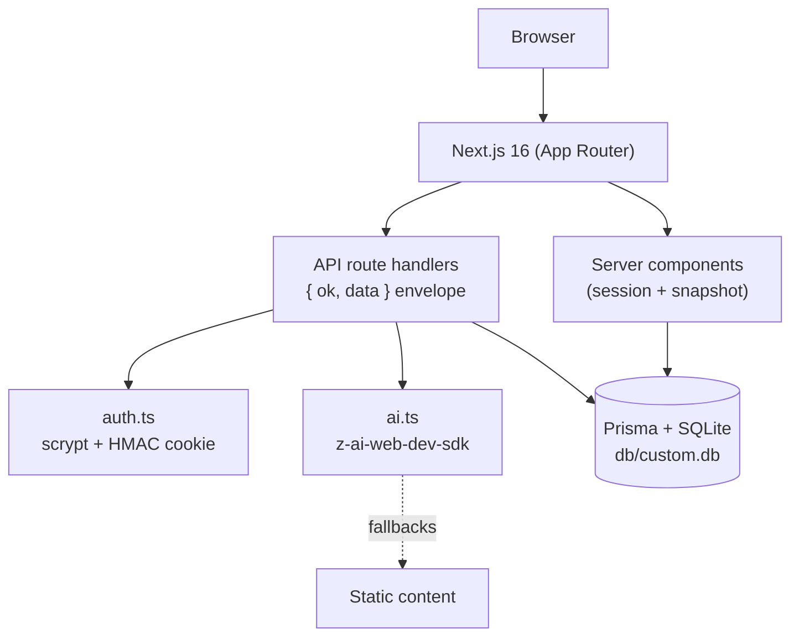

# Thinkerwell — Personalized Tutor App

      

**A self-hosted, production-grade clone of the base44 Personalized Tutor App (Thinkerwell) — an AI tutoring partner that uses the Socratic method to build personalized learning paths, find knowledge gaps, and coach learners through a 3-level mastery grid.**

The reference app is a closed SaaS (base44) whose entity writes are locked behind platform auth; this clone reproduces the full experience — onboarding, AI course generation, the diagnostic quiz with gap analysis, the learning Hub with the Nori chat tutor, and progress tracking — on a stack you own: one Next.js 16 app, a SQLite database, and an AI seam that degrades gracefully when the LLM is unavailable.

## Features

| | Feature | Where |
|---|---------|-------|
| 🔐 | Email/password auth (scrypt + HMAC cookie sessions, rate-limited) | `src/lib/auth.ts` + `/api/auth/*` |
| 🧭 | Onboarding dashboard: typewriter hero (reference topic list), mode cards, category tags | `/` + `/onboarding` |
| 🤖 | AI course generation: 3-stage roadmap from any topic or pasted material | `/api/courses/generate` |
| 📝 | Diagnostic quiz: 5 AI questions (the live's E3 port — star progress, tan options, skip + close paths) → gap analysis → roadmap, confetti at 3/7 correct | `/quiz` |
| 📚 | Course dashboard: welcome hero, progress stats, daily challenge modal, learning roadmap | `/?course=<id>` |
| 🎓 | The Hub: desktop three-pane (lessons sidebar / Nori chat / lesson content), mobile Learn·Ask Nori·Lessons tab shell | `/hub` |
| 💬 | Nori, the Socratic AI tutor — persistent chat history per course | `/api/chat` |
| 🗛 | The reference's exact 99-line quote pool, random pick per page load | `src/lib/quotes.ts` |
| 🪟 | The Q5 "Add a Course" in-page modal: Build/Material mode cards, 6 quick tags, Paste Text/Upload File tabs, Start Assessment → `/quiz?course=` | `src/components/courses/add-course-modal.tsx` |
| 🅿️ | The reference's two-dropdown header: bordered Course pill (p_) + m_ user menu with the course context line and inline Update Preferences (PUT /api/student) | `src/components/layout/app-header.tsx` |
| ✅ | Lesson quizzes ported to the reference flow: 1000 ms reveal + auto-advance, retry-later re-queue, 8-to-complete | `src/components/hub/lesson-view.tsx` |
| 🃏 | The reference's tan 2-column option grid, per-level context cards, and per-question video/reading content cards | `src/components/hub/lesson-view.tsx` |
| 🧭 | The quiz-derived progress model (the live has no per-lesson entity): round(score/5×100) → lessons → stages | `src/lib/domain.ts` |
| 🎉 | Confetti moments: the dashboard's streak + mastery-label bursts (the live's c_ port), level-up, dual-cannon course completion | `src/lib/confetti.ts` + `dashboard-app.tsx` |
| 🔥 | Study Streak + Total XP cards (the reference's gamification column) | `src/components/dashboard/course-dashboard.tsx` |
| 🖼️ | Pixel-measured design system: yellow chrome, purple setup panel, animated mascot | `src/app/globals.css` + `public/*.svg` |
| 👻 | Guest demo route with the reference's sample Economics course (auth-gated like the live) | `/demo` |
| 🌱 | Public onboarding: anonymous `/` renders the landing surface with the deferred sign-up flow | `src/app/page.ts` + `onboarding-dashboard.tsx` |
| 🧪 | 201 unit tests + 91 Playwright e2e checks (incl. the mobile-nav regression pin + the trap-39 conventions pin + the shard-env + shard-plan pins + the canonical AI-route-set pins) | `tests/` |

## Architecture

| Layer | Technology | Purpose |
|-------|-----------|---------|
| Framework | Next.js 16 (App Router, standalone output) | Server components resolve state; client components own interactivity |
| Language | TypeScript 5 (strict) | End-to-end types, explicit `typecheck` gate |
| Styling | Tailwind CSS v4 (CSS-first `@theme`, no config file) | Measured token system with v4 engine-trap pins |
| Database | SQLite + Prisma 6 | Zero-config persistence; schema-relative `file:` URL resolution |
| Auth | Hand-rolled scrypt + HMAC-signed cookie | No external auth dependency; 7-day sessions |
| AI | `z-ai-web-dev-sdk` (server-only) | Roadmap/quiz/lesson/chat generation with static fallbacks |
| Tests | Vitest (unit) + Playwright (e2e, standalone server on :3100) | The only CI — the local gate is the gate |



## File Hierarchy

```
📂 prisma                  schema.prisma (7 models) + idempotent seed
📂 public                  mascot.svg, logo.svg (extracted from the live app)
📂 src/app                 routes: /, /login, /onboarding, /courses, /quiz, /hub, /demo
 │  └─ 📂 api              15 route handlers (auth, courses, quiz, lessons, chat, progress, challenge, health)
 ├── 📄 globals.css        Tailwind v4 @theme tokens + the five engine-trap pins + toaster fix
 ├── 📄 layout.tsx         Root layout: Google Fonts (Funnel Sans + Eczar)
📂 src/components
 ├── 📂 layout             app-header.tsx (Course pill + user menu dropdowns, mobile hamburger)
 ├── 📂 dashboard          onboarding / course / demo shells (the demo runs the guest-mode header)
 ├── 📂 hub                hub-app.tsx, nori-chat.tsx, lesson-view.tsx
 ├── 📂 quiz               quiz-app.tsx (the 5-question E3 diagnostic surface)
 ├── 📂 courses            courses-app.tsx + add-course-modal.tsx (the Q5 port)
 ├── 📂 login              login-card.tsx (slate surface, sign-in/up modes)
 └── 📄 mascot.tsx         SVG wrappers, toast.tsx (Sonner-compatible, pointer-events fixed)
📂 src/lib                 api.ts, auth.ts, ai.ts, domain.ts (pure mastery grid), db.ts, db-path.ts, quotes.ts, rate-limit.ts
📂 tests                   domain.test.ts + e2e/ (Playwright specs incl. mobile-navigation.spec.ts)
📄 docs/                   Tailwind-V4-Validation-Report.md, ssh push runbook, screenshots/
```

## Quick Start

Prerequisites: **Node.js ≥ 20** (or Bun ≥ 1.1), no external services.

```bash
bun install                      # or: npm install
cp .env.example .env             # defaults are fine for local dev
bun run db:push                  # create db/custom.db from the schema
bun run db:seed                  # demo account + sample Economics course
bun run dev                      # http://localhost:3000
```

**Verify setup**

```bash
curl -s localhost:3000/api/health        # {"ok":true,"data":{"status":"ok","db":true}}
bun run lint && bun run typecheck && bun run test   # all green
```

Open http://localhost:3000 and sign in with the demo account:
**`demo@thinkerwell.app` / `Demo1234!`** — or watch the guest experience at
`/demo`, or register a fresh account and run the full
topic → diagnostic quiz → AI-generated course flow.

**Demo login:** `demo@thinkerwell.app` / `Demo1234!`

## Environment Variables

| Variable | Purpose | Required |
|----------|---------|----------|
| `DATABASE_URL` | SQLite `file:` URL (relative resolves against `prisma/schema.prisma`); or a PostgreSQL string | ✅ |
| `AUTH_SECRET` | HMAC key for session cookies (`openssl rand -hex 32`); insecure dev fallback when unset | in prod |
| `NEXT_PUBLIC_SITE_URL` | Canonical origin for metadata | optional |

## Testing

```bash
bun run test          # 201 Vitest unit checks (domain grid, quote pool, gamification math, quiz-derived progress, db-path, source-predicate split, lesson-row status, from_url contract, onboarding thresholds, diagnostic-score semantics, mastery tiers, material gate, the AI-seam wrapper parsing + the captured-transport prompt-split pins, the dual-shape roadmap + the isStageObject guard, the e2e trap-39 timeout conventions, the sharded-e2e env derivation, the balanced-shard plan derivation, the canonical AI route set — filesystem-pinned against the @/lib/ai importers)
bun run build         # standalone production build (e2e prerequisite)
bun run test:e2e      # 91 Playwright checks against the standalone server on :3100
                      # boots its own db/e2e.db (pushed + seeded by the global setup)
bun run test:e2e:sharded  # the SAME 91 checks as 3 parallel playwright shards
                      # (own port/DB/auth/outputDir per shard — tests/e2e/shard-env.ts;
                      # WHOLE-FILE assignment by AI weight — tests/e2e/shard-plan.ts)
```

The e2e suite covers: the auth surface (login, signup, bad credentials,
redirects), the yellow header chrome, the course dashboard (incl. the
Study Streak + Total XP cards and the challenge modal), the Hub panes, the
lesson-quiz flow (auto-advance + retry modal), Nori chat persistence, the
courses page, the guest demo — and the **mobile-navigation regression pin**
(390×844): the empty toast layer must stay `pointer-events-none` so the
hamburger menu stays tappable. The live reference ships this bug; the clone
fixes it and the spec proves it.

## The Tailwind v4 trap log

This clone pins eight v3→v4 engine differences discovered while porting the
reference's byte-identical class attributes — full report in
[`docs/Tailwind-V4-Validation-Report.md`](docs/Tailwind-V4-Validation-Report.md):

1. Full-hex theme vars (bare HSL triplets resolve transparent under v4)
2. v3 palette hexes pinned (v4's oklch defaults drift 1-3 sRGB units)
3. Gradients ship as sRGB-equivalent arbitrary values (v4 interpolates oklab)
4. `space-y-*` children with explicit margins render differently — avoid the combo
5. `--shadow-sm` pinned to the v3 geometry (v4 shifted the scale one notch)
6. `--radius-lg`/`--radius-xl` pinned to 12px (the reference's custom scale; v4 ships 8/14px)
7. `--blur-sm` pinned to 4px (v4 doubled the scale one notch — the shadow trap's sibling)
8. Alpha colors on pinned surfaces ship as inline `rgba()` (v4's `bg-black/50`/
   `text-black/40` compute `oklab(0 0 0 / .5)` vs v3's `rgba(0,0,0,.5)`;
   achromatic-equivalent — normalize where computed parity is pinned)

Plus the mobile-nav toaster fix: the notifications container is
`pointer-events-none` (items restore `auto`), so an empty toast layer can
never cover the header's hamburger button.

## The session-2 parity pass

A second audit against the live bundle
([`docs/remediation-plan-session-2.md`](docs/remediation-plan-session-2.md))
closed the remaining behavioral gaps: the typewriter topic list, the exact
99-line quote pool with per-load random picks, the lesson-quiz flow
(auto-advance, retry-later re-queue, 8-to-complete), the three confetti
moments, the Study Streak + Total XP cards, the interactive Daily Challenge
modal, and the conditional Course Progress tint. Every one of them is mined
verbatim from the reference and pinned by tests.

## The session-3 architecture pass

A third audit ([`docs/remediation-plan-session-3.md`](docs/remediation-plan-session-3.md))
decoded the reference's actual component functions from the bundle and
ported them wholesale: the lesson view's gO/yO/xO level layouts (subject h2
on level 1, per-level context cards) + Im per-question content cards
(video shimmer + reading cards), the tan 2-column option grid with
"Next Question", the hub sidebar's 3-state rows (done/active/locked), the
session-scoped "{answered + 1}/8" Lesson Progress card, the per-stage
lesson-title suffixes, the mobile lessons sheet, and the subject-icon course
cards — plus the biggest semantic discovery: the reference's dashboard
progress is QUIZ-DERIVED (`round(score/5×100)`), which is exactly why its
demo shows 60% with a 3/7 quiz score.

## The session-5 chrome-polish pass

A fifth audit ([`docs/remediation-plan-session-5.md`](docs/remediation-plan-session-5.md))
decoded the reference's mobile hamburger menu as its OWN component (a Switch
Course section with a Check on the current course, guest-mode Sign In, no
Update Preferences) and the m_ panel's name split (the panel header renders
the student's name — the rename target — while the pill keeps the user's
name). It also completed the `rounded-[9999px]` sweep for computed-style
parity with the reference's v3 radii, retimed the typewriter to the exact
bundle timings (60/50 ms per char, 2000 ms hold, full first topic on load),
and matched the 21px category chips.

## The session-6 parity-polish pass

A sixth audit ([`docs/remediation-plan-session-6.md`](docs/remediation-plan-session-6.md))
verified the mobile menu end-to-end against the live (the Switch Course
section, the Check on the current course, the guest Sign In variant — all
runtime-confirmed) and closed the remaining icon-level drifts decoded from
the live DOM and bundle: the /courses Add tile's Plus path (the clone shipped
a typo'd `M12 5v19`), the CO card's ChevronRight stroke, and the m_ pill
chevron's two-variant weight (2 with a course, 1.5 without). It also
extracted the outside-click dismissal into one shared hook
(`src/components/layout/use-dismiss.ts`) consumed by every dropdown
including the hub's, named the typewriter timings as constants, and pinned
the intentional source-predicate split (`isCustomSource` vs the new
`courseSourceLabel`). 65 → 69 unit, 45 → 46 e2e.

## The session-7 computed-style parity pass

A seventh audit ([`docs/remediation-plan-session-7.md`](docs/remediation-plan-session-7.md))
introduced **computed-style histogram diffing** (leaf-text font-weight
distributions + class-to-radius maps, live vs clone) and closed the drifts it
surfaced: the app-wide base font-weight (the live defaults to font-light 300,
inherited by every weight-less text node), TWO new Tailwind v4 engine traps —
the radius-scale shift (`rounded-lg`/`rounded-xl` both compute 12px on the
reference's custom v3 config vs v4's 8/14px — Trap 6) and the blur-scale shift
(the login card's `backdrop-blur-sm` computes 4px on v3 vs 8px on v4 — Trap 7,
the `--shadow-sm` pin's sibling) — and the Course-Lessons icon column (lucide
CircleCheckBig/Circle status icons decoded from the live, replacing the
scaffold's numbered circles, keyed off a new `lessonRowStatus` domain helper).
69 → 73 unit, 46 → 52 e2e.

## The session-8 public-surface parity pass

An eighth audit ([`docs/remediation-plan-session-8.md`](docs/remediation-plan-session-8.md))
probed the live's ANONYMOUS surfaces for the first time and found the
public-surface model inverted: the live's anonymous `/` and `/onboarding`
render the onboarding itself (black Sign In pill, items-only mobile menu,
the "Your Name" block, the `pending_student_setup` deferral → login → the
post-login pickup auto-generates → `/quiz`), `/demo` is auth-gated, and the
"Try it Sample" card is a NAVIGATION to `/demo` — never a course generation
(dead code in the bundle). The same pass decoded the hub LessonView h2
subject (`student.current_subject || "General"`, never the course name),
the challenge modal's real contract (black/50 overlay, no blur, no result
banner — Submit swaps to Close), the dashboard card icons (Trophy/Brain at
24px where the clone shipped TrendingUp/Sparkles at 20px), and a NEW
Tailwind v4 engine trap — the alpha-color serialization drift
(`bg-black/50`/`text-black/40` compute `oklab(...)` vs v3's `rgba(...)`,
Trap 8; pinned surfaces normalize via inline rgba). 73 → 82 unit,
52 → 64 e2e.

## The session-9 level-surface parity pass

A ninth audit ([`docs/remediation-plan-session-9.md`](docs/remediation-plan-session-9.md))
drove the live's quiz flow through a FULL lesson completion for the first
time (observing the terminal state the prior sessions never reached) and
re-decoded the hub's level machinery from the bundle: the Lesson Progress
label is **unclamped** (the live renders "9/8" at the 8th correct — the
clone had a Math.min clamp; now `lessonProgressLabel`/`lessonProgressPct`
are unit-pinned domain helpers); the desktop anonymous Sign In pill carries
`from_url` (the live's `navigateToLogin` = `redirectToLogin(
window.location.href)`); the live's sidebar advance logic is dead code (its
hub dead-ends after lesson 1 — the clone's advancing flow is the pinned
fix); and the never-before-pinned **level-2/3 lesson surfaces** (the tan
Real-World Scenario card, the lilac Final Boss Challenge card, the
generated-title h2) gained e2e coverage via the `?lesson=2|4` params. The
pass also caught a lucide version trap: **BookOpen and Trophy were
redesigned upstream between the live's 0.475 and the clone's 0.525** — the
dashboard icons pin the live's exact paths as parameterized local
components. 82 → 91 unit, 64 → 69 e2e.

## The session-10 chat-surface parity pass

A tenth audit ([`docs/remediation-plan-session-10.md`](docs/remediation-plan-session-10.md))
drove the live's Nori chat through a real exchange for the first time (the
session-9 handoff's suggested target) and decoded four more surfaces: the
chat USER bubble is **BLACK `#0F0E0E` with white text** (radius 16/16/4 —
the clone's yellow bubble was a session-1 invention), the send button
carries lucide's **Send paper plane** at w-3.5 h-3.5 (paths verified
identical across the live's lucide 0.475 and the clone's 0.525 — the one
safe lucide swap), the client-side `from_url` contract carries the **path
AND the query** (the live's `navigateToLogin` = the full
`window.location.href` — now routed through one `loginRedirectUrl` helper
with a same-origin guard on the login side that FIXES the open-redirect
vulnerability the live ships), and the hub's back-links + "?" menu match
the live exactly (the logo and mobile Dashboard link carry `?course=`,
the "?" menu renders the empty-name header with a LayoutGrid icon). The
mobile-nav headline was re-verified with the toaster-cover mechanism
precisely measured (the live's menu still cannot be tapped open; the
clone's fix + pins hold). 91 → 108 unit, 69 → 76 e2e.

## The session-11 quiz-surface parity pass

An eleventh audit ([`docs/remediation-plan-session-11.md`](docs/remediation-plan-session-11.md))
decoded the diagnostic quiz's component (E3) straight from the live bundle
(the entity-write 403s block a live drive, so the bundle is the ground
truth) and found the session-1 quiz surface was almost entirely invention:
the live asks **5 questions** (not 7), renders a minimal
"{subject} · Knowledge Assessment" header with an X close button
(replacing the user menu), a **star-icon progress row** on a `#4A4A4A`
track, a lilac number tile, **tan options with inline A./B. prefixes**,
"Submit Assessment" as the final action, a dot strip, and a fixed
"Skip quiz →" pill. The pass also fixed the score semantics (the live
computes the CORRECT count client-side — the clone's server derivation
scored every answered question correct, so every completed quiz scored
100%), aligned the /-route model (the course dashboard renders whenever an
enrollment exists — the skip/close paths land on the 0% dashboard), and
aligned the AI prompts (the named/pct-aware gap analysis, the material
context, the pct-based roadmap). 108 → 125 unit, 76 → 82 e2e.

## The session-12 dashboard-decode parity pass

A twelfth audit ([`docs/remediation-plan-session-12.md`](docs/remediation-plan-session-12.md))
decoded the dashboard's right column (c_) straight from the (unchanged)
live bundle and found three more drifts: **the quiz-milestone confetti was
misplaced** — the session-2 decode found the 80-particle call but put it
mid-quiz, while the live's E3 fires nothing during the quiz (the decoded
triggers live on the DASHBOARD: the streak burst when min(quizScore,7)
crosses exactly 3 or 7, plus a 90-particle burst when the mastery tier —
Novice→Apprentice→…→Master at 0/20/40/60/80/100 — changes; the label never
renders, it exists for the trigger); **the session-11 material gate was
dead code** (`contentSource === "custom"` is unreachable — every clone
writer emits `topic`/`material`, so the material-context prompts never
fired; the gate is now the broad `enrollmentMaterial` predicate); and the
**generate-time roadmap prompt had drifted** onto the submit-time wording
(the live carries three distinct prompt shapes, and its LLM answers the
`{"steps":[…]}` wrapper the clone now parses). Plus polish: the Enter The
Hub trailing icon decoded as ChevronRight (the ArrowRight was a session-1
invention), the submit route 422s on malformed payloads, and the quiz
star now rides a `next/image` wrapper. 125 → 153 unit, 82 → 86 e2e.

## The session-13 course-switch + data-contract pass

A thirteenth audit
([`docs/remediation-plan-session-13.md`](docs/remediation-plan-session-13.md))
found the session-12 confetti port's real blocker: **the same-route course
switch was functionally broken** — the dashboard shell's `viewCourseId`
state was frozen at mount (its setter had no caller), so the CoursePill
rows' navigation changed the URL while the dashboard kept rendering the
mount-time course (empirically: the pre-switch course's streak/XP
persisted until a full reload — and the session-12 "the App Router
remounts the page" diagnosis was wrong: nothing remounts, the stale state
simply ignored the fresh props). `activeCourse` now derives from the
URL-resolved `currentCourseId` prop, which fixes the switch AND finally
delivers the live's c_ confetti surface — a course switch crossing a
streak boundary or mastery tier now fires the ported bursts in place
(e2e-pinned with dedicated content/burst/label drives). The same pass:
hardened the `{steps}` wrapper parser (a lazy string reply crashed the
route with a 500 — the "AI may degrade, never fail" invariant), split
the roadmap response schemas to the live's verbatim decode (generate-time
objects vs submit-time STRING arrays, with `parseRoadmap` mapping both
via the live's Kh/card split semantics), completed the submit route's
422 symmetry (non-array answers, non-integer total), and hardened the
e2e AI-timeout convention. 153 → 175 unit, 86 → 90 e2e.

## The session-14 pin-the-pin pass

A fourteenth audit
([`docs/remediation-plan-session-14.md`](docs/remediation-plan-session-14.md))
turned the audit on the session-13 commit itself and found the one real
gap: **the prompt-split unit test was vacuous** — the test named for the
S13-F5/F8 "verbatim parity" contained only `expect(true).toBe(true)`
with a comment claiming the mock's call history "is not directly
exposed" (it is: the mocked `completions.create(req)` receives
`req.messages`). The pins now assert both roadmap prompt tails VERBATIM
from the captured transport request, plus bidirectional negatives —
mutation-verified (swapping the tails fails exactly the two new pins).
The same pass: the streak-burst e2e drive gained its first CONFOUND-FREE
isolation pin (scores 6/7 with total 7 clamp the percent to 100 →
Master→Master so only the exact-7 streak crossing can fire — pixel-
verified at 1,383 burst-particle pixels), the submit route consolidated
to validate-first/derive-after (the 422 matrix byte-identical), the
dual-shape OBJECT arm became ONE shared `isStageObject` guard in
domain.ts, the `ai.ts` "THREE prompts" comment now names the discarded
skip-time variant, and the superseded session-11 one-shot probes were
retired (their coverage lives in the e2e spec). 175 → 179 unit,
90 → 91 e2e.

## The session-15 conventions pass

A fifteenth audit
([`docs/remediation-plan-session-15.md`](docs/remediation-plan-session-15.md))
followed the session-14 handoff's test-quality/hygiene direction and found
the audit surface exactly as predicted: no parity gaps (the live bundle
byte-identical for the 6th consecutive session, the mobile-nav headline
re-verified — the live's hamburger still refuses the tap while the clone's
12/12 pins hold). The real findings were three conventions that existed but
were enforced nowhere: **the trap-39 60s-timeout convention had never been
backfilled to the four specs session-13 didn't touch** (8 AI-backed
request-level calls riding Playwright's 30s default against the 45s AI
budget — a latent flake that only fires when the LLM is reachable-but-slow),
**the e2e course fixtures were triplicated** (generateCourse/freshCourse +
the afterEach cleanup ~120 duplicated lines across session11/12/13 — the
root cause of the first drift), and **the lint gate suppressed rules the
codebase already passes**. The remediation: the timeouts backfilled and the
convention made self-enforcing — `tests/e2e-conventions.test.ts` scans
every spec source with a balanced-paren scanner and fails the UNIT gate if
any AI-backed request call lacks `timeout: 60_000` (a scanner-self-test
guards the empty-match case); the fixtures extracted to one canonical
`tests/e2e/helpers.ts`; and the lint gate hardened to the strongest
zero-findings ruleset (`react-hooks/purity` back at next-default error,
prefer-const/no-unreachable/no-redeclare/no-useless-escape/no-console at
warn, no-console scoped off for the probe scripts; exhaustive-deps stays
off by documented trade-off — the 3 intentional suppressions in the pinned
quiz-flow timing effects). The same session diagnosed and documented the
**orphaned-webServer trap** (a tool-timeout kill leaves the :3100 server
alive; a later `next build` swaps `.next/static` under it → ChunkLoadError →
hydration fails → every AI-effect test hangs — kill it with
`ss -tlnp | grep 3100` before a fresh run). 179 → 182 unit, 91 e2e
(unchanged — the helper refactor is count-invariant).

## The session-16 dead-code/deps pass

A sixteenth audit
([`docs/remediation-plan-session-16.md`](docs/remediation-plan-session-16.md))
followed the session-15 handoff's three suggested directions and closed
all three: **`react-hooks/exhaustive-deps` is now ON** (the session-15
"documented trade-off" retired — the 3 former suppressions were
refactored to the latest-ref pattern: a `useRef` + a no-deps update
effect declared before the consumer decouples the callback identity
from the pinned firing triggers, no useCallback refactor needed;
lesson-view's two reporters + onboarding's post-login pickup, the
quiz-flow auto-advance semantics e2e-pinned throughout), **the 18
`src/` unused-vars findings cleaned to zero** (6 genuine dead-code
sites removed — the vestigial `courseName`/`user`/`studentName` props,
the never-rendered `deleting` state, the uncalled `toast`
destructure, `fallbackLesson`'s vestigial `lessonNumber` — plus 5
script-level cleanups; the rule enabled TS-aware so named
type-contract params keep their documentation names), and **the unit
runner runs `isolate: false`** (a 5× wall-clock win, 1.9s → ~0.4s —
validated with 5 full runs including 2 shuffle-seed orderings before
adoption). The live bundle re-verified **byte-identical for the 7th
consecutive session** and the mobile-nav headline re-verified for the
7th (the live's hamburger tap still refuses — the toaster cover; the
clone's fix + 12/12 real-tap pins hold on the fresh build). 182 unit +
91 e2e unchanged (the session is pure hygiene — behavior-preserving
refactors proven by the existing pins).

## The session-17 lint/sharding/manifest pass

A seventeenth audit
([`docs/remediation-plan-session-17.md`](docs/remediation-plan-session-17.md))
followed the session-16 handoff's three directions and closed all three,
again with zero parity gaps behind them (the live bundle byte-identical for
the **8th** consecutive session; the mobile-nav headline re-verified for
the 8th — the live's hamburger tap still refuses behind the toaster cover
while the clone's 12/12 real-tap pins hold). (1) **The scaffold lint block
retired to its final two DOCUMENTED offs** — `no-debugger`,
`no-irregular-whitespace`, `no-case-declarations`, `no-fallthrough`,
`no-mixed-spaces-and-tabs`, and `no-empty` all enabled (each
experiment-verified at zero findings; the one `no-empty` finding was an
empty `catch {}` in the probe script's retry loop, fixed with a
self-documenting comment instead of an option relaxation); `no-undef`
stays off with the rationale documented (not type-aware — it
false-positives the JSX scope's `React` and the `@types/node` ambient
`NodeJS`; the typecheck gate owns the real hazard); and a dead duplicate
`@typescript-eslint/no-unused-vars: "off"` entry removed (the session-16
enablement block already wins by JS duplicate-key semantics — the dead
line misread as "the rule is off"). (2) **`bun run test:e2e:sharded`** —
the same 91 e2e checks as three parallel playwright shards, each with its
own port (3111-3113), own `db/e2e-shard-{k}.db`, own auth state, and own
`test-results/shard-{k}/` artifacts (a shared outputDir is a cross-process
disposal race — the failure mode the first sharded runs hit before the
per-shard dir existed). The serial `test:e2e` stays the byte-compatible
default; the sharded mode kills the 12-15-minute slow-LLM wall clock and
the chunking ceremony in one command. The derivation is one pure,
unit-pinned module (`tests/e2e/shard-env.ts` — 182 → 186 unit); the
wrapper only orchestrates (orphan pre-flight per trap 41, spawn via
`bunx playwright`, aggregate, cleanup). (3) **The dependency manifest's
lower bounds now mirror the gate-verified lockfile** (next `^16.3.8`,
react `^19.3.0`, prisma `^6.19.3`, …) — a zero-resolution-change edit
(the lockfile diff only re-records the declared ranges); the majors
(Prisma 7, lucide-react 1.x, eslint 10, TypeScript 7) stay out of scope
by doctrine — a lucide major would re-drift every decoded icon path.

## The session-19 balance + strictness pass

A nineteenth audit
([`docs/remediation-plan-session-19.md`](docs/remediation-plan-session-19.md))
followed the session-17 handoff's directions with the live bundle
**byte-identical for the 9th consecutive session** and the mobile-nav
headline re-verified for the 9th (the live's hamburger tap still refuses
behind the toaster cover; the clone's 12/12 real-tap pins hold). (1)
**The sharded e2e harness now plans shards by AI weight** — playwright's
count-based `--shard=k/N` split put 17 of the 22 direct AI-route
request-level calls on ONE shard (session11+12+13+10-parity), so in the
reachable-but-slow LLM regime (each AI call budgeting 45s) that shard
alone approached the full serial wall clock while the others idled. The
plan (`tests/e2e/shard-plan.ts`, unit-pinned) is LPT bin-packing over
`weight = aiMentions × 45 + tests`; the wrapper derives the inventory
from playwright's own `--list`, prepends `auth.setup.ts` to every
shard's file list (the same setup-duplication `--shard` provided), and
ENFORCES the count invariant at runtime (the per-shard "N passed" lines
must sum to `total + N − 1`). The plan lands 364/313/313 on the current
inventory — a ~2.1× improvement of the slow-regime critical path
(serial still the byte-compatible default; the sharded run executes the
same 91 unique checks). (2) **`noImplicitAny: true`** — the last
scaffold TypeScript concession (PAD K-4) retired for FREE: the flip
produced zero typecheck errors on the current tree (canary-verified the
flag bites — TS7006 on any new implicit-any), so the typecheck gate now
hardens against untyped parameters instead of riding the concession.
197 unit (the eleven shard-plan pins join) + 91 e2e, both e2e modes
green. The AI-seam e2e speedup (recorded fixtures) was reviewed and
DEFERRED by documented rationale: the suite exists to exercise the real
seam and its 429-fallback paths — the balanced sharding captures most
of the wall-clock win without changing what is verified.

## The session-21 canonical route-set pass

A twenty-first audit
([`docs/remediation-plan-session-21.md`](docs/remediation-plan-session-21.md))
followed the session-19 handoff's third direction ("the two AI-route
regexes can drift — extract a single exported constant module") and
found the drift had ALREADY happened: the shard-plan's `AI_ROUTE_PATTERN`
carried a SEVENTH alternative (`quiz/skip`) that the conventions scanner
deliberately excludes (the live's skip fires an LLM call its own code
discards; the clone skips the wasted call — so that route makes NO AI
call), while the module's own comment and pin both claimed "the six
routes the conventions scanner knows" — a self-contradictory pin that
inflated session11-parity's shard weight by 45 for a route with no AI
cost. The fix is the canonical module `tests/e2e/ai-routes.ts`
(`AI_BACKED_ROUTES` + the derived pattern) imported by BOTH scanners, and
a FILESYSTEM-AUTHORITY pin that walks `src/app/api/**/route.ts` and
asserts the set equals the actual `@/lib/ai` importers — the set can
never drift from the code again. The same pass closed two stale-doc
drifts (the PAD §1.2 table still said `noImplicitAny: false`; the SKILL
§11 checklist still said 153/86) and re-reviewed the handoff's other two
directions (recorded fixtures, measured weight calibration) — deferred
with documented rationale. The plan re-landed 364/291/290 (session11 at
96, the spurious 45 gone). 197 → 201 unit, 91 e2e (unchanged), both e2e
modes green; the live bundle byte-identical for the 10th consecutive
session and the mobile-nav headline re-verified for the 10th.

## Pushing to GitHub

Commits reach `git@github.com:nordeim/personalized-tutor-app.git` through
the SSH wrapper — never a plain `git push`:

```bash
# gates green + commits on main, then:
python3 docs/ssh_git_wrapper_v3.py --key-file /secure/deploy.key \
  --remote git@github.com:nordeim/personalized-tutor-app.git
```

The wrapper materializes the key into a 0600 temp file outside the repo,
authenticates, pushes `HEAD:refs/heads/main`, verifies the remote ref
equals local HEAD, then shreds the key. Full runbook (including the
paramiko shim for OpenSSH-less sandboxes):
[`docs/how-to-git-push-using-ssh-wrapper_SKILL.md`](docs/how-to-git-push-using-ssh-wrapper_SKILL.md).

## License

Private clone project for evaluation and self-hosting. All design tokens,
copy, and mascot artwork were extracted from the live reference app for
parity purposes.
